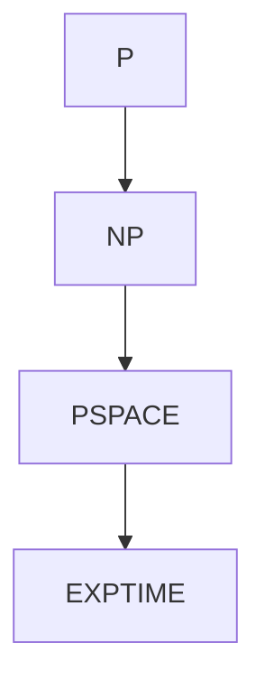

# Fondements et rappels : Classes de complexité fondamentales

## 1- Définition et exemples des classes P, NP, PSPACE, EXPTIME

En théorie de la complexité, on classifie les problèmes de décision selon les ressources nécessaires pour être résolus ou vérifiés. Ces classes permettent de comprendre comment l'effort computationnel évolue avec la taille de l'entrée, en général désignée par n.

---

### Classe P (Polynomial Time)

- **Définition** : L'ensemble des problèmes de décision qui peuvent être **résolus en temps polynomial** par une machine de Turing déterministe.  
- **Interprétation** : Les algorithmes efficaces ou « faisables » en pratique appartiennent souvent à cette classe.  
- **Exemples** : 
  - Tri de listes, recherche dans des structures de données ordonnées (ex : recherche binaire),
  - Calcul du plus court chemin dans un graphe avec l'algorithme de Dijkstra (graphes à poids positifs).
  
---

### Classe NP (Nondeterministic Polynomial Time)

- **Définition** : L'ensemble des problèmes de décision dont une solution proposée peut être **vérifiée** en temps polynomial par une machine de Turing déterministe. Alternativement, ils peuvent être résolus en temps polynomial par une machine de Turing non déterministe.  
- **Remarque importante** : P est inclus dans NP car toute solution qu'une machine déterministe peut trouver en temps polynomial peut aussi être vérifiée en temps polynomial.  
- **Exemples** : 
  - Problème du voyageur de commerce (TSP) : vérifier une solution (un chemin donné) est rapide, mais trouver la solution est difficile,  
  - La satisfiabilité booléenne (SAT).
  
---

### Classe PSPACE (Polynomial Space)

- **Définition** : La classe des problèmes pouvant être résolus par une machine de Turing déterministe en utilisant **un espace mémoire polynomial** par rapport à la taille de l'entrée. Le temps peut être exponentiel, mais la mémoire reste limitée polynomiale.  
- **Relation** : Contient P et NP.  
- **Exemples** :  
  - Jeux à deux joueurs avec une profondeur polynomiale, comme le jeu de hex,  
  - Problèmes de logique propositionnelle plus complexes,  
  - Validation de certains types d'automates.
  
---

### Classe EXPTIME (Exponential Time)

- **Définition** : Ensemble des problèmes décisionnels pouvant être résolus en **temps exponentiel** par une machine de Turing déterministe, c’est-à-dire en temps du type \(2^{p(n)}\) où \(p\) est un polynôme.  
- **Relation** : Contient strictement PSPACE, NP, et donc P (la hiérarchie est P \(\subseteq\) NP \(\subseteq\) PSPACE \(\subseteq\) EXPTIME).  
- **Exemples** :  
  - Résolution exacte de certains jeux d’échecs ou de go en taille arbitraire (sans heuristique),  
  - Certaines questions liées à l'analyse de modèles formels complexes.

---

## Illustration de la hiérarchie des classes (diagramme Mermaid)

Ce diagramme illustre la relation d'inclusion connue parmi ces classes : chaque classe est contenue dans la suivante ou dans un ensemble plus large.

---

## Résumé des relations clés

- **P** : problèmes décidables efficacement (polynomial déterministe).  
- **NP** : problèmes dont la solution peut être vérifiée efficacement; le statut P = NP est encore ouvert.  
- **PSPACE** : problèmes résolvables avec mémoire polynomiale, plus large que NP.  
- **EXPTIME** : problèmes nécessitant un temps exponentiel, incluant toutes les classes précédentes.

---

## Sources utilisées

- [Complexity Classes — Not just your regular Big-O, medium.com](https://medium.com/@ajin.sunny/complexity-classes-not-just-your-regular-big-o-9cb217097ed9)  
- [Complexity Classes: P, NP, co-NP, PSPACE, concretenonsense.wordpress.com](https://concretenonsense.wordpress.com/2011/07/21/complexity-classes-p-np-co-np-pspace/)  
- [Complexity class, Wikipedia](https://en.wikipedia.org/wiki/Complexity_class)  
- [A Short Guide to Hard Problems, quantamagazine.org](https://www.quantamagazine.org/a-short-guide-to-hard-problems-20180716/)

---

Cet article synthétise les fondements des classes fondamentales de la complexité algorithmique en insistant sur leurs définitions formelles, leurs relations inclusives, et des exemples concrets pour chaque classe. Une bonne compréhension de ces notions est indispensable pour analyser la faisabilité algorithmique des problèmes étudiés en informatique théorique.