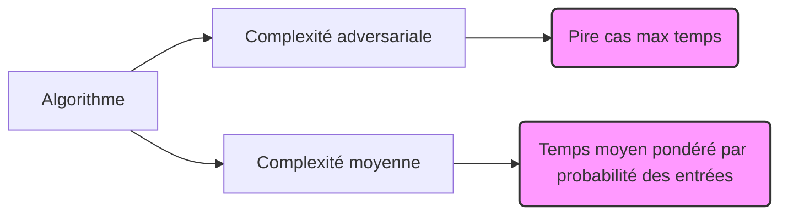

# Complexité paramétrée et cas moyens : Distinction entre complexité moyenne et adversariale

## 1- Complexité moyenne et adversariale

Lors de l’analyse d’algorithmes, il est fondamental de comprendre deux approches principales de mesure de la complexité : la complexité moyenne (**average-case complexity**) et la complexité adversariale (**worst-case complexity**). Ces deux notions offrent des perspectives différentes sur la difficulté des problèmes et la performance des algorithmes.

---

## Complexité adversariale (Worst-case complexity)

- **Définition** : La complexité adversariale mesure la performance maximale d’un algorithme sur toutes les entrées possibles de taille \(n\).  
- **Caractéristique** : Elle donne une borne supérieure absolue, garantissant que jamais l’algorithme ne dépassera ce temps.  
- **Contextes d’utilisation** : Très utilisée en théorie, en particulier dans des contextes où garantir un temps maximum d’exécution est nécessaire (systèmes embarqués, sécurité).  

**Exemple** :  
Le tri rapide (Quicksort) a un pire cas \(\mathcal{O}(n^2)\), lorsqu’on trie une liste déjà triée selon un mauvais pivot.

---

## Complexité moyenne (Average-case complexity)

- **Définition** : Mesure attendue sur la distribution des entrées d’une taille fixe, considérant chaque entrée avec une probabilité donnée.  
- **Caractéristique** : Reflète typiquement la performance observée en pratique si la distribution des données est bien modélisée.  
- **Difficulté** : Nécessite un modèle probabiliste réaliste des entrées — souvent supposé uniforme, ce qui peut ne pas correspondre aux données réelles.  

**Exemple** :  
Quicksort : complexité moyenne \(\mathcal{O}(n \log n)\) si les pivots sont choisis aléatoirement ou si la permutabilité des données est supposée.

---

## Points clés de distinction

| Aspect                  | Complexité adversariale   | Complexité moyenne           |
|-------------------------|--------------------------|-----------------------------|
| Assurance              | Garantie sur toutes les entrées | Moyenne selon une distribution spécifique   |
| Modélisation des entrées | Aucune                    | Cruciale, hypothèses sur la distribution |
| Robustesse              | Très robuste, pessimiste | Sensible aux hypothèses     |
| Usage                   | Contextes critiques, théorique | Analyse statistique, performances pratiques |

---

## Illustration Mermaid synthétique

---

## Exemples concrets

- **Recherche dans une liste non triée**

  - **Adversariale** : \(\mathcal{O}(n)\) car l’élément peut être absent ou en fin de liste.  
  - **Moyenne** : \(\mathcal{O}(n/2)\), soit toujours linéaire mais deux fois plus petit en moyenne si éléments uniformément distribués.

- **Table de hachage**

  - **Adversariale** : Dans le pire cas, insertion et recherche peuvent coûter \(\mathcal{O}(n)\) (si collisions massives).  
  - **Moyenne** : Temps constant \(\mathcal{O}(1)\) en moyenne, sous hypothèses de bonne répartition des clés.

---

## Sources utilisées

- [Average-case complexity — Wikipedia](https://en.wikipedia.org/wiki/Average-case_complexity)  
- [Worst-case vs Average-case Complexity Explained - GeeksforGeeks](https://www.geeksforgeeks.org/worst-average-and-amortized-analysis/)  
- [Complexity theory, MIT OpenCourseWare](https://ocw.mit.edu/courses/electrical-engineering-and-computer-science/6-840j-computational-complexity-theory-fall-2005/lecture-notes/)  
- Motwani R., Raghavan P., “Randomized Algorithms”, Cambridge University Press, 1995.

---

Cet article explicite clairement la distinction entre complexité moyenne et adversariale, deux concepts fondamentaux permettant d’évaluer la performance d’algorithmes selon différents points de vue, notamment en fonction des garanties recherchées et de la nature des données traitées.