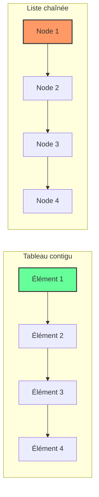

# Cours Avancé en Algorithmique — Séance 1 : Rappels et Introduction avancée  
## Partie 2 : Théorie — Optimisation et Gestion Mémoire Avancée (0.5h)  
### Contenu : Choix de structures de données : tableau vs liste chaînée, leurs compromis

---

## 1. Introduction

Le choix d’une structure de données impacte directement la performance, la gestion mémoire et la simplicité d’implémentation. Deux structures fondamentales sont le **tableau (array)** et la **liste chaînée (linked list)**. Comparer leurs avantages et inconvénients éclaire leur usage adapté selon les besoins.

---

## 2. Structure de données : Définitions

- **Tableau (Array) :**  
  Contigu en mémoire, accès direct en temps constant \( O(1) \) via index. Sa taille est généralement fixée à la création.

- **Liste chaînée (Linked List) :**  
  Chaîne d’éléments (noeuds) reliés par des pointeurs/ références. Taille dynamique, insertion/suppression aisée.

---

## 3. Comparaison détaillée

| Critère               | Tableau                              | Liste chaînée                      |
|-----------------------|------------------------------------|-----------------------------------|
| **Accès aléatoire**   | \( O(1) \) — accès direct par index| \( O(n) \) — doit parcourir la liste |
| **Insertion**         | \( O(n) \) — décalage possible     | \( O(1) \) — simple ré-affectation de pointeurs |
| **Suppression**       | \( O(n) \) — décalage possible     | \( O(1) \) — déconnexion du noeud  |
| **Gestion mémoire**   | Mémoire contiguë, overhead faible   | Overhead mémoire important (pointeurs) |
| **Taille**            | Fixe ou redimensionnement coûteux   | Dynamique, flexible                |
| **Localité mémoire**  | Excellente, favorise cache CPU      | Fragile — discontinuité mémoire    |
| **Complexité de la structure** | Simple                       | Complexe (pointeurs, gestion des liens) |

---

## 4. Exemples concrets

### 4.1 Accès direct dans un tableau

```c
int tab[5] = {1,2,3,4,5};
int val = tab[3]; // accès direct en O(1)
```

### 4.2 Insertion dans une liste chaînée

```c
typedef struct Node {
    int data;
    struct Node* next;
} Node;

void inserer_debut(Node** head, int val) {
    Node* nouveau = malloc(sizeof(Node));
    nouveau->data = val;
    nouveau->next = *head;
    *head = nouveau;
}
```

Insérer un élément en début se fait en temps \( O(1) \), sans déplacement d’éléments comme dans un tableau.

---

## 5. Diagramme Mermaid — Illustration mémoire



---

## 6. Choix selon les cas d’usage

- **Tableau :** idéal lorsque la taille est connue, accès fréquent par index, et cas d’exécution nécessitant rapidité mémoire et CPU (ex : calcul matriciel, vecteurs).

- **Liste chaînée :** adaptée quand la taille varie, les insertions/suppressions fréquentes mais accès par index rare (ex : files d'attente, piles, gestion dynamique).

---

## 7. Sources et lectures complémentaires

- [GeeksforGeeks – Array vs Linked List](https://www.geeksforgeeks.org/array-vs-linked-list/)
- [Medium – When to use Linked List over Array](https://medium.com/swlh/when-to-use-linked-list-over-array-18adb874a0b9)
- [Wikipedia – Data Structure](https://en.wikipedia.org/wiki/Data_structure)
- [Guru99 – Arrays and Linked Lists](https://www.guru99.com/array-vs-linked-list.html)
- [Computer Science Field Guide – Arrays and Linked Lists](https://csfieldguide.org.nz/en/chapters/data/arrays-and-linked-lists.html)

---

Privilégier le tableau ou la liste chaînée dépend des besoins en accès rapide, gestion dynamique de la mémoire et fréquence des opérations d’insertion/suppression. Une bonne compréhension des compromis inspire des choix optimisés dans le langage C et l’algorithmique avancée.