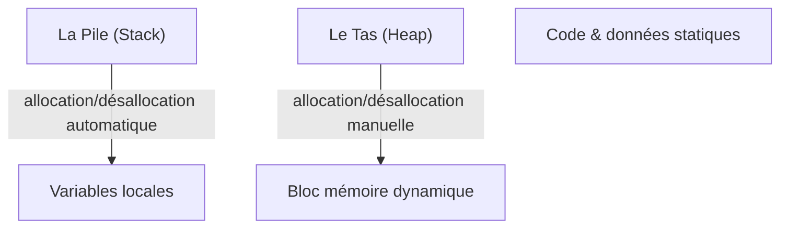

# Cours Avancé en Algorithmique — Séance 1 : Rappels et Introduction avancée  
## Partie 2 : Théorie — Optimisation et Gestion Mémoire Avancée (0.5h)  
### Contenu : Rappel sur la pile et le tas (stack and heap)

---

## 1. Introduction

Dans la gestion mémoire d’un programme en langage C (et en général dans la plupart des langages compilés), deux régions clés sont utilisées pour stocker les données :

- **La pile (stack)**  
- **Le tas (heap)**

Comprendre leurs caractéristiques permet d’optimiser la gestion mémoire, la sécurité et la performance.

---

## 2. La pile (stack)

### 2.1 Description

- Zone mémoire **statique** et **structurée** en mode LIFO (Last In, First Out).
- Gère essentiellement les variables locales, les paramètres de fonctions et le contexte d’appel.
- Allocation et désallocation se font automatiquement à l’entrée et sortie de blocs/fonctions.
  
### 2.2 Caractéristiques

| Caractéristique        | Description                        |
|-----------------------|----------------------------------|
| Allocation            | Automatique                      |
| Taille                | Limitée, généralement faible (~1Mo à quelques Mo) |
| Accès                 | Très rapide, adressage contigu   |
| Durée de vie          | Cycle d’une fonction/portée locale |
| Sécurité              | Gestion simple mais risque de débordement (stack overflow) |

### 2.3 Exemple

```c
void fonction() {
    int a = 10;    // variable sur la pile
    int tab[100];  // tableau sur la pile
}
```

- Les variables `a` et `tab` sont allouées à l’entrée de `fonction` et libérées à sa sortie.

---

## 3. Le tas (heap)

### 3.1 Description

- Zone mémoire **dynamique** gérée manuellement via des appels d’allocation (`malloc`, `calloc`) et de libération (`free`).
- Permet d’allouer des espaces mémoire dont la taille peut être décidée à l’exécution.

### 3.2 Caractéristiques

| Caractéristique        | Description                        |
|-----------------------|----------------------------------|
| Allocation            | Manuelle (via malloc/free)        |
| Taille                | Plus grande, limitée surtout par mémoire physique disponible |
| Accès                 | Plus lent que la pile (fragmentation, non contiguë) |
| Durée de vie          | Contrôlée par le programme       |
| Sécurité              | Risque de fuites mémoire, déréférencement |

### 3.3 Exemple

```c
void fonction() {
    int *ptr = malloc(sizeof(int) * 100); // allocation sur le tas
    if (ptr == NULL) exit(EXIT_FAILURE);
    // utilisation...
    free(ptr);  // libération mémoire
}
```

---

## 4. Comparaison Tableau : Pile vs Tas

| Critère                | Pile (Stack)                   | Tas (Heap)                     |
|------------------------|-------------------------------|--------------------------------|
| Allocation             | Automatique                   | Manuelle (malloc/free)          |
| Vitesse d’allocation   | Très rapide                   | Plus lente                     |
| Taille                 | Limitée                      | Plus importante                |
| Fragmentation          | Pas de fragmentation         | Possible fragmentation mémoire |
| Durée de vie des données| Limité à la portée locale    | Contrôlable globalement        |
| Erreurs fréquentes      | Débordement pile             | Fuites mémoire, double free    |

---

## 5. Diagramme Mermaid — Visualisation mémoire



---

## 6. Synthèse et recommandations

- Pour des allocations temporaires et taille connue, privilégier la pile (variables locales).
- Pour des données dont la taille est dynamique ou persistante, utiliser le tas.
- Toujours libérer la mémoire allouée sur le tas pour éviter les fuites (ex.: utiliser `free`).
- Attention aux dépassements de pile (variables trop volumineuses) et aux erreurs sur le tas (déréférencement de pointeurs invalides, fuites).

---

## 7. Sources consultées

- [GeeksforGeeks – Stack vs Heap](https://www.geeksforgeeks.org/difference-between-stack-and-heap-memory/)
- [Medium – Understanding Stack and Heap Memory in C](https://medium.com/@sakshamsaxena/understanding-stack-and-heap-memory-in-c-2e8b226b3aea)
- [Wikipedia – Stack (computer science)](https://en.wikipedia.org/wiki/Call_stack)
- [Wikipedia – Heap (data structure)](https://en.wikipedia.org/wiki/Heap_(data_structure)#Heap_(memory))
- [TutorialsPoint – Stack vs Heap](https://www.tutorialspoint.com/difference-between-stack-and-heap-memory)

---

Ce rappel clarifie la distinction fondamentale entre pile et tas, aspect central dans l’optimisation mémoire et la stabilité des programmes avancés en C, notamment dans la gestion fine des allocations dynamiques et la prévention d’erreurs mémoire.
