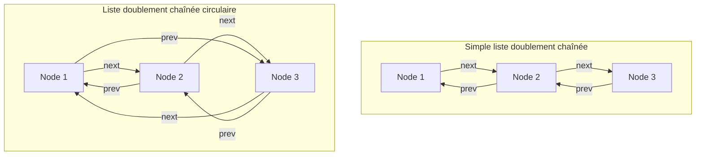

# Cours Avancé en Algorithmique — Séance 2 : Structures de données dynamiques avancées  
## Partie 1 : Théorie — Listes Doublement Chaînées et Circulaires (1h)  
### Contenu : Principes et structures des nœuds

---

## 1. Introduction aux listes doublement chaînées et circulaires

Les listes doublement chaînées sont une amélioration des listes simplement chaînées, offrant une navigation bidirectionnelle aisée entre les nœuds. Leur version circulaire ajoute la caractéristique selon laquelle le dernier nœud pointe vers le premier et inversement, formant une boucle.

---

## 2. Structure des nœuds dans une liste doublement chaînée

Chaque nœud de liste doublement chaînée contient :

- Un champ **donnée** (payload)
- Un pointeur vers le nœud **précédent** (`prev`)
- Un pointeur vers le nœud **suivant** (`next`)

**Définition typique en C :**

```c
typedef struct Node {
    int data;
    struct Node *prev;
    struct Node *next;
} Node;
```

---

## 3. Fonctionnement

- Le pointeur `prev` permet la navigation inverse, facilitant la suppression ou insertion sans parcours préalable.
- Le pointeur `next` maintient le lien avant.
- Le premier nœud a généralement `prev` à `NULL` sauf dans une liste circulaire.
- Le dernier nœud a `next` à `NULL` sauf dans une liste circulaire.

---

## 4. Listes doublement chaînées circulaires

Dans cette variante :

- Le `next` du dernier nœud pointe vers le premier.
- Le `prev` du premier nœud pointe vers le dernier.

Cela rend la liste circulaire, supportant ainsi une navigation cyclique infinie dans les deux directions, idéale pour certains algorithmes (ex : gestion files circulaires, anneaux).

---

## 5. Diagramme Mermaid : Structure d'une liste doublement chaînée simple et circulaire



---

## 6. Exemples d’opérations sur les nœuds

### 6.1 Insertion après un nœud donné

```c
void inserer_apres(Node *node, int val) {
    if (!node) return;
    Node *nouveau = malloc(sizeof(Node));
    nouveau->data = val;
    nouveau->next = node->next;
    nouveau->prev = node;

    if (node->next)
        node->next->prev = nouveau;
    node->next = nouveau;
}
```

### 6.2 Suppression d’un nœud

```c
void supprimer(Node **head, Node *node) {
    if (!head || !*head || !node) return;

    if (node->prev)
        node->prev->next = node->next;
    else
        *head = node->next; // node est la tête

    if (node->next)
        node->next->prev = node->prev;

    free(node);
}
```

---

## 7. Avantages et inconvénients

| Aspects               | Liste doublement chaînée           |
|-----------------------|----------------------------------|
| Navigation            | Bidirectionnelle, accès facile dans les deux sens  |
| Insertion/suppression  | Efficace, nécessite peu de déplacements            |
| Complexité mémoire    | Coût mémoire plus élevé (deux pointeurs par nœud) |
| Implémentation        | Plus complexe qu’une liste simple                    |
| Usage circulaire      | Adaptée aux structures cycliques, gestion fluide    |

---

## 8. Sources consultées

- [GeeksforGeeks — Doubly Linked List](https://www.geeksforgeeks.org/doubly-linked-list/)
- [TutorialsPoint — Data Structures Doubly Linked List](https://www.tutorialspoint.com/data_structures_algorithms/doubly_linked_list_algorithm.htm)
- [Wikipedia — Doubly linked list](https://en.wikipedia.org/wiki/Doubly_linked_list)
- [Wikipedia — Circular doubly linked list](https://en.wikipedia.org/wiki/Doubly_linked_list#Circular_doubly_linked_list)

---

Les listes doublement chaînées et circulaires avec leur gestion des nœuds offrent une souplesse algorithmique importante, notamment pour des manipulations bidirectionnelles performantes, à la condition de bien maîtriser leur structure mémoire et le lien des pointeurs.
