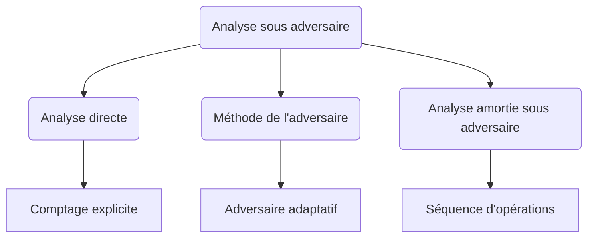

# Complexité paramétrée et cas moyens : Méthodes d'analyse de la complexité sous adversaire

## 2 - Méthodes d’analyse de la complexité sous adversaire

L'analyse de la complexité sous adversaire (ou analyse du pire cas) vise à évaluer la performance d’un algorithme dans la situation la plus défavorable possible. Elle garantit des bornes maximales sur les ressources utilisées, indépendamment des hypothèses sur la distribution des entrées. Plusieurs méthodes existent pour mener cette analyse rigoureuse.

---

## Principales méthodes d’analyse sous adversaire

### 1. Analyse directe

- **Principe** : Étude explicite du comportement de l’algorithme sur l’entrée produisant le pire temps d’exécution.  
- **Utilisation** : Approche classique, calculant une borne supérieure par dénombrement d’opérations coûteuses.  
- **Exemple** :  
  Dans l’algorithme de recherche linéaire, l’analyse directe montre que le pire cas correspond à l’élément recherché absent, donc examen de tous les éléments : complexité \(\mathcal{O}(n)\).

### 2. Méthode de l’adversaire (adversarial argument)

- **Principe** : Imaginant un adversaire qui choisit dynamiquement l’entrée la plus défavorable possible en réponse aux décisions de l’algorithme.  
- **Utilité** : Montre souvent que l’algorithme ne peut pas être meilleur que telle borne.  
- **Exemple** :  
  - Recherche binaire sur une séquence triée : adversaire adapte la réponse « plus grand » ou « plus petit » pour maximiser le nombre de comparaisons (complexité \(\Omega(\log n)\)).  
  - Tri par comparaisons : adversaire construit une séquence d’entrée imposant \(\Omega(n \log n)\) comparaisons.

### 3. Analyse amortie à adversaire

- **Principe** : Quand une exécution ressort du pire cas ponctuel, mais peut être compensée par d’autres opérations plus rapides sur la séquence.  
- **Exemple** : Opérations sur structures dynamiques (tas, tableaux dynamiques), où la suppression ou ajout prend souvent un coût moyen plus faible que le pire cas isolé.

---

## Exemples précis

| Méthode            | Exemples                              | Description de l’analyse                 |
|--------------------|-------------------------------------|-----------------------------------------|
| Analyse directe    | Recherche linéaire, tri fusion       | Calcul du temps maximal explicitement    |
| Méthode de l’adversaire | Recherche binaire, tri par comparaisons | Modélisation du choix de l’entrée la pire possible en réponse à l’algorithme |
| Analyse amortie sous adversaire | Table de hachage dynamique, pile dynamique | Moyenne sur une séquence d'opérations confrontée à un adversaire |

---

## Diagramme Mermaid illustrant les méthodes

---

## Intérêt et limites

- **Avantages** :  
  - Permet de garantir une performance minimale quelle que soit l’entrée.  
  - Outil de preuve de bornes inférieures.  

- **Limites** :  
  - Peut être pessimiste, ne reflétant pas la performance en situation réelle.  
  - Souvent difficile à appliquer sans simplifications.  
  - Dans certains cas, difficile d’identifier une entrée réellement « pire » pour tous les algorithmes.

---

## Sources utilisées

- [Worst-case complexity — Wikipedia](https://en.wikipedia.org/wiki/Worst-case_complexity)  
- [Adversarial argument - Complexity Zoo](https://complexityzoo.net/Complexity_Zoo:A#adversarial_argument)  
- [Amortized Analysis and the Accounting Method, CLRS](https://mitpress.mit.edu/books/introduction-algorithms-third-edition)  
- [Algorithmic Lower Bounds via an Adversary Argument](https://cs.stackexchange.com/questions/41377/what-is-the-adversary-lower-bound-technique)  

---

Cet article synthétise les méthodes couramment utilisées pour analyser la complexité en situation adversariale, permettant de comprendre comment caractériser les performances des algorithmes dans leurs cas les plus défavorables et quelles stratégies sont adoptées pour établir ces bornes rigoureuses.