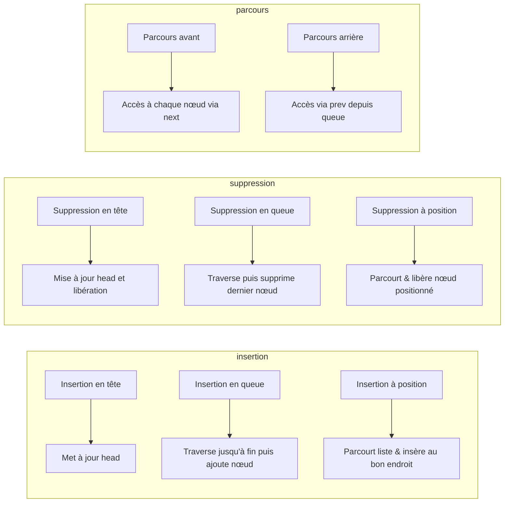

# Cours Avancé en Algorithmique — Séance 2 : Structures de données dynamiques avancées  
## Partie 1 : Théorie — Listes Doublement Chaînées et Circulaires
### Contenu : Opérations (insertion, suppression, parcours) en tête, en queue, à une position donnée

---

## 1. Introduction

Les listes doublement chaînées permettent une manipulation efficace des éléments, grâce à un accès direct et bidirectionnel. Ce cours présente les principales opérations sur ces listes : insertion, suppression et parcours, que ce soit en tête, en queue ou à une position arbitraire.

---

## 2. Structure rappelée du nœud

```c
typedef struct Node {
    int data;
    struct Node *prev;
    struct Node *next;
} Node;
```

Un pointeur vers la tête de la liste est généralement maintenu.

---

## 3. Insertion

### 3.1 Insertion en tête

- Crée un nouveau nœud.
- Le nouveau nœud pointe vers l’ancienne tête.
- Met à jour le `prev` de l’ancienne tête.
- La tête devient le nouveau nœud.

```c
void inserer_tete(Node **head, int val) {
    Node *nouveau = malloc(sizeof(Node));
    if (!nouveau) return;
    nouveau->data = val;
    nouveau->prev = NULL;
    nouveau->next = *head;

    if (*head) (*head)->prev = nouveau;
    *head = nouveau;
}
```

### 3.2 Insertion en queue

- Parcourt la liste jusqu’à la queue.
- Crée un nouveau nœud, positionnée après le dernier.
- Met à jour les pointeurs `next` et `prev`.

```c
void inserer_queue(Node **head, int val) {
    Node *nouveau = malloc(sizeof(Node));
    if (!nouveau) return;
    nouveau->data = val;
    nouveau->next = NULL;

    if (*head == NULL) {
        nouveau->prev = NULL;
        *head = nouveau;
        return;
    }

    Node *temp = *head;
    while (temp->next) temp = temp->next;

    temp->next = nouveau;
    nouveau->prev = temp;
}
```

### 3.3 Insertion à une position donnée

- Positionne un index `pos` (0-based) dans la liste.
- Insère un nouveau nœud **avant** le nœud à cette position.
- Gère les cas particuliers (tête, fin, position invalide).

```c
void inserer_position(Node **head, int val, int pos) {
    if (pos == 0) {
        inserer_tete(head, val);
        return;
    }

    Node *temp = *head;
    for (int i = 0; i < pos - 1 && temp != NULL; i++)
        temp = temp->next;

    if (!temp) return; // position invalide

    Node *nouveau = malloc(sizeof(Node));
    if (!nouveau) return;
    nouveau->data = val;

    nouveau->next = temp->next;
    if (temp->next)
        temp->next->prev = nouveau;

    temp->next = nouveau;
    nouveau->prev = temp;
}
```

---

## 4. Suppression

### 4.1 Suppression en tête

```c
void supprimer_tete(Node **head) {
    if (!head || !*head) return;

    Node *temp = *head;
    *head = temp->next;

    if (*head)
        (*head)->prev = NULL;

    free(temp);
}
```

### 4.2 Suppression en queue

- Parcourt jusqu’à dernier nœud.
- Déconnecte le dernier nœud.
- Libère la mémoire.

```c
void supprimer_queue(Node **head) {
    if (!head || !*head) return;

    Node *temp = *head;
    if (!temp->next) { // un seul nœud
        free(temp);
        *head = NULL;
        return;
    }

    while (temp->next) temp = temp->next;

    temp->prev->next = NULL;
    free(temp);
}
```

### 4.3 Suppression à une position donnée

- Parcourt la liste à la position `pos`.
- Déconnecte le nœud correspondant.
- Libère la mémoire.

```c
void supprimer_position(Node **head, int pos) {
    if (!head || !*head) return;
    Node *temp = *head;

    for (int i = 0; i < pos && temp != NULL; i++)
        temp = temp->next;

    if (!temp) return;

    if (temp->prev)
        temp->prev->next = temp->next;
    else
        *head = temp->next;

    if (temp->next)
        temp->next->prev = temp->prev;

    free(temp);
}
```

---

## 5. Parcours de la liste

### 5.1 Parcours en avant

```c
void afficher_avant(Node *head) {
    Node *temp = head;
    while (temp) {
        printf("%d ", temp->data);
        temp = temp->next;
    }
    printf("\n");
}
```

### 5.2 Parcours en arrière

Pour parcourir en arrière, il faut accéder au dernier nœud puis rebrousser chemin via `prev`.

```c
void afficher_arriere(Node *head) {
    if (!head) return;
    Node *temp = head;
    while (temp->next) temp = temp->next;

    while (temp) {
        printf("%d ", temp->data);
        temp = temp->prev;
    }
    printf("\n");
}
```

---

## 6. Détail pour listes doublement chaînées circulaires

- Le test `temp->next == NULL` est remplacé par `temp->next != head`.
- Les opérations d’insertion, suppression, parcours prennent en compte la boucle infinie.

Exemple insertion en queue (circulaire) :

```c
void inserer_queue_circ(Node **head, int val) {
    Node *nouveau = malloc(sizeof(Node));
    nouveau->data = val;

    if (*head == NULL) {
        nouveau->next = nouveau->prev = nouveau;
        *head = nouveau;
        return;
    }

    Node *tail = (*head)->prev;

    tail->next = nouveau;
    nouveau->prev = tail;
    nouveau->next = *head;
    (*head)->prev = nouveau;
}
```

---

## 7. Diagramme Mermaid — Opérations principales sur liste doublement chaînée



---

## 8. Sources consultées

- [GeeksforGeeks — Doubly Linked List Overview and Operations](https://www.geeksforgeeks.org/doubly-linked-list/)
- [Programiz — Doubly Linked List in C](https://www.programiz.com/dsa/doubly-linked-list)
- [TutorialsPoint — Doubly Linked List Operations](https://www.tutorialspoint.com/data_structures_algorithms/doubly_linked_list_algorithm.htm)
- [Wikipedia — Doubly linked list](https://en.wikipedia.org/wiki/Doubly_linked_list)

---

Les opérations sur listes doublement chaînées impliquent une gestion attentive des pointeurs `prev` et `next` pour maintenir la cohérence des liens. La maîtrise de ces opérations est indispensable pour manipuler efficacement ces structures dynamiques aussi bien en mode linéaire que circulaire.
