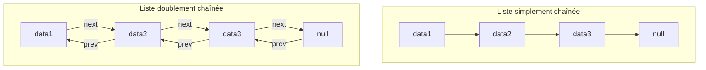

# Cours Avancé en Algorithmique — Séance 2 : Structures de données dynamiques avancées  
## Partie 1 : Théorie — Listes Doublement Chaînées et Circulaires (1h)  
### Contenu : Avantages et inconvénients par rapport aux listes simplement chaînées

---

## 1. Rappel des structures

- **Liste simplement chaînée (Singly linked list)** : un nœud contient une donnée et un pointeur vers le nœud suivant.  
- **Liste doublement chaînée (Doubly linked list)** : un nœud contient une donnée, un pointeur vers le nœud suivant, et un pointeur vers le nœud précédent.  
- **Listes circulaires** : format où le dernier nœud pointe vers le premier, avec versions simples ou doublement chaînées.

---

## 2. Avantages des listes doublement chaînées par rapport aux listes simplement chaînées

| Avantages | Explications |
|-----------|--------------|
| **Navigation bidirectionnelle** | La présence du pointeur `prev` permet de parcourir la liste en avant comme en arrière, ce qui facilite certaines opérations comme la recherche inverse ou l'itération depuis la fin. |
| **Suppression simplifiée** | Supprimer un nœud (hors tête) est plus efficace car on peut accéder directement au nœud précédent sans parcourir la liste depuis le début. |
| **Insertion plus flexible** | L’insertion avant ou après un nœud est directe, même si on ne dispose que du pointeur vers ce nœud. |
| **Support naturel des listes circulaires** | Les listes doublement chaînées circulaires facilitent le parcours continu (rotatif), typiques dans la gestion d’anneaux ou buffers circulaires. |
| **Facilitation de certaines structures** | Data structures comme les déques (double-ended queues) reposent sur cette bidirectionnalité. |

---

## 3. Inconvénients des listes doublement chaînées par rapport aux listes simplement chaînées

| Inconvénients | Explications |
|---------------|--------------|
| **Coût mémoire accru** | Chaque nœud stocke un pointeur supplémentaire (`prev`), ce qui augmente la consommation mémoire. |
| **Complexité de gestion** | La gestion des pointeurs `prev` et `next` est plus complexe, augmentant les possibilités d’erreurs (liens cassés, pointeurs sauvages). |
| **Performances moindres dans certains cas** | Dans les scénarios où seul un parcours avant est nécessaire, la liste simple est plus légère et plus rapide en termes de cache mémoire. |
| **Opérations plus coûteuses en maintenance** | Les opérations d'insertion et suppression doivent gérer deux pointeurs à mettre à jour, augmentant la complexité du code. |

---

## 4. Tableau comparatif synthétique

| Critère               | Liste simplement chaînée             | Liste doublement chaînée                    |
|-----------------------|------------------------------------|---------------------------------------------|
| Stockage              | 1 pointeur par nœud (next)         | 2 pointeurs par nœud (prev + next)          |
| Navigation            | Unidirectionnelle                   | Bidirectionnelle                             |
| Suppression           | Nœud précédent non accessible directement | Nœud précédent accessible directement       |
| Insertion             | Pas d’accès facilité avant un nœud | Accès flexible avant et après un nœud       |
| Complexité code       | Plus simple                        | Plus complexe                                |
| Usage mémoire         | Moins                            | Plus                                         |
| Adaptation à certains algorithmes | Moins adaptée (ex: parcours inverse) | Plus adaptée (ex: déques, listes circulaires) |

---

## 5. Exemples d’utilisation illustrant l’avantage

**Suppression d’un nœud donné (pas la tête) dans une liste simplement chaînée :**

Il faut parcourir la liste pour retrouver le nœud précédent, ce qui coûte \(O(n)\).

```c
void supprimerNode(Node **head, Node *node) {
    if (*head == node) {
        *head = (*head)->next;
        free(node);
        return;
    }

    Node *temp = *head;
    while (temp && temp->next != node) {
        temp = temp->next;
    }

    if (temp == NULL) return;

    temp->next = node->next;
    free(node);
}
```

**Dans une liste doublement chaînée**, on accède directement au nœud précédent sans parcours.

```c
void supprimerNodeD(Node **head, Node *node) {
    if (!node) return;

    if (node->prev)
        node->prev->next = node->next;
    else
        *head = node->next;

    if (node->next)
        node->next->prev = node->prev;

    free(node);
}
```

---

## 6. Diagramme Mermaid — Comparaison visuelle des liaisons



---

## 7. Sources consultées

- [GeeksforGeeks — Difference between Singly and Doubly Linked List](https://www.geeksforgeeks.org/difference-between-singly-linked-list-and-doubly-linked-list/)
- [TutorialsPoint — Singly vs Doubly Linked Lists](https://www.tutorialspoint.com/data_structures_algorithms/doubly_linked_list_algorithm.htm)
- [Wikipedia — Doubly linked list](https://en.wikipedia.org/wiki/Doubly_linked_list)
- [Programiz — Doubly Linked List](https://www.programiz.com/dsa/doubly-linked-list)

---

La sélection entre liste simplement ou doublement chaînée dépend des exigences fonctionnelles : la bidirectionnalité apporte plus de flexibilité et efficacité dans certains cas, au prix d’une surcharge mémoire et d’une gestion pointer plus minutieuse.
