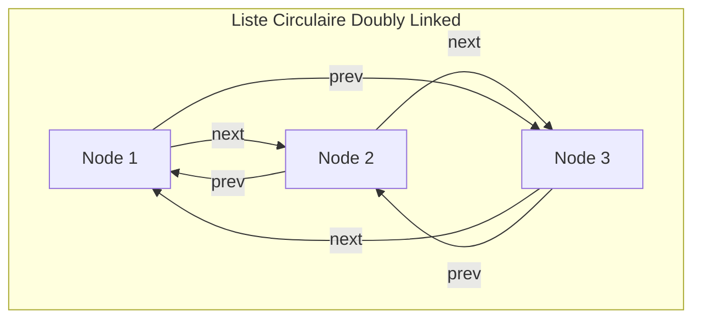

# Cours Avancé en Algorithmique — Séance 2 : Structures de données dynamiques avancées  
## Partie 1 : Théorie — Listes Doublement Chaînées et Circulaires (1h)  
### Contenu : Implémentation de listes circulaires

---

## 1. Introduction

Une **liste circulaire** est une structure de données dynamique où le dernier nœud pointe vers le premier, formant un cycle. Lorsqu’elle est combinée avec une structure doublement chaînée, elle permet un parcours bidirectionnel infini, adapté à de nombreux cas d’usage (files circulaires, gestion d’anneaux, algorithmes de buffer).

---

## 2. Différences entre listes circulaires simples et doublement chaînées

| Type | Description | Illustration des liens |
| -------- | --------- | ---------------------- |
| Liste simplement chaînée circulaire | Le dernier nœud pointe vers la tête. Permet un seul sens de parcours circulaire. | Last -> First -> ... -> Last |
| Liste doublement chaînée circulaire | Le dernier pointe vers la tête et la tête pointe vers le dernier via `prev`. Navigation dans les deux sens en boucle fermée. | Last <-> First <-> ... <-> Last |

---

## 3. Structure d’un nœud pour liste doublement chaînée circulaire

```c
typedef struct Node {
    int data;
    struct Node *prev;
    struct Node *next;
} Node;
```

Dans ce modèle, la tête (head) de la liste est un pointeur vers le premier nœud. Le nœud dernier a `next` pointant vers la tête, et la tête a `prev` pointant vers le dernier.

---

## 4. Implémentation des principales opérations

### 4.1 Insertion en tête

```c
void inserer_tete_circulaire(Node **head, int val) {
    Node *nouveau = malloc(sizeof(Node));
    if (!nouveau) return;
    nouveau->data = val;

    if (*head == NULL) {
        nouveau->next = nouveau->prev = nouveau;
        *head = nouveau;
        return;
    }

    Node *last = (*head)->prev;

    nouveau->next = *head;
    nouveau->prev = last;

    last->next = nouveau;
    (*head)->prev = nouveau;

    *head = nouveau;
}
```

### 4.2 Insertion en queue

```c
void inserer_queue_circulaire(Node **head, int val) {
    if (*head == NULL) {
        inserer_tete_circulaire(head, val);
        return;
    }

    Node *last = (*head)->prev;
    Node *nouveau = malloc(sizeof(Node));
    if (!nouveau) return;

    nouveau->data = val;
    nouveau->next = *head;
    nouveau->prev = last;

    last->next = nouveau;
    (*head)->prev = nouveau;
}
```

### 4.3 Suppression d’un nœud donné

```c
void supprimer_node_circulaire(Node **head, Node *node) {
    if (!head || !*head || !node) return;

    if (node->next == node && node->prev == node) { // Un seul nœud
        free(node);
        *head = NULL;
        return;
    }

    node->prev->next = node->next;
    node->next->prev = node->prev;

    if (*head == node)
        *head = node->next;

    free(node);
}
```

---

## 5. Parcours de la liste circulaire

### Parcours avant avec arrêt d’un cycle complet

```c
void afficher_liste_circulaire(Node *head) {
    if (!head) return;
    Node *temp = head;

    do {
        printf("%d ", temp->data);
        temp = temp->next;
    } while (temp != head);

    printf("\n");
}
```

---

## 6. Diagramme Mermaid — Structure et lien dans une liste doublement chaînée circulaire



---

## 7. Particularités

- La liste peut être vide (`head == NULL`).
- Les cas spéciaux (un seul nœud) doivent être correctement gérés.
- Le pointeur `head` reste utile pour toujours accéder au début, bien que la liste soit cyclique.

---

## 8. Sources consultées

- [GeeksforGeeks — Circular Doubly Linked List](https://www.geeksforgeeks.org/circular-doubly-linked-list/)
- [Programiz — Circular Doubly Linked List in C](https://www.programiz.com/dsa/circular-doubly-linked-list)
- [TutorialsPoint — Circular Doubly Linked List Algorithms](https://www.tutorialspoint.com/data_structures_algorithms/circular_doubly_linked_list_algorithm.htm)
- [Wikipedia — Circular doubly linked list](https://en.wikipedia.org/wiki/Doubly_linked_list#Circular_doubly_linked_list)

---

La liste doublement chaînée circulaire combine les avantages du parcours bidirectionnel avec la flexibilité d’une structure sans fin, essentielle pour des algorithmes nécessitant un contrôle fluide des rotations et accès cycliques.
