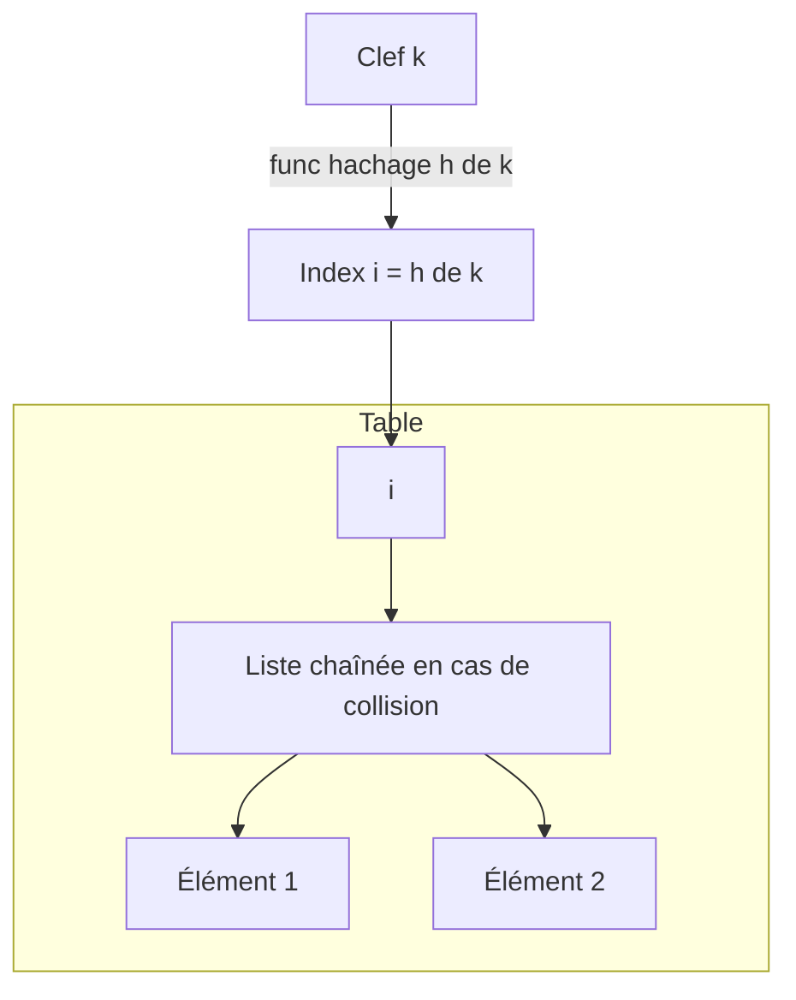

# Cours Avancé en Algorithmique — Séance 2 : Structures de données dynamiques avancées  
## Partie 2 : Théorie — Tables de Hachage (1h)  
### Contenu : Principe du hachage, fonctions de hachage

---

## 1. Principe du hachage

La **table de hachage** est une structure de données dynamique permettant d’associer clefs et valeurs avec un accès proche de \(O(1)\) en moyenne. Elle repose sur une fonction de hachage transformant une clef en un **indice** dans un tableau.

### Fonctionnement résumé :

- On calcule un **hachage** de la clé, produisant un entier (par exemple entre 0 et taille_table-1).
- Cet entier sert d’indice pour stocker ou récupérer la valeur associée.
- En cas de collision (plusieurs clefs ayant le même hachage), des techniques spécifiques doivent être employées (chaînage, sondage).

---

## 2. Fonction de hachage

Une fonction de hachage \(h : K \rightarrow \{0, ..., m-1\}\) prend une clef \(k \in K\) et renvoie un indice dans un espace d’adresses limité (table de taille \(m\)).

### Propriétés recherchées :

- **Uniformité** : répartition homogène des indices pour réduire les collisions.
- **Rapidité** : calcul efficace.
- **Déterminisme** : même clef doit toujours retourner la même valeur.
- **Sensibilité aux différences** : clefs différentes doivent idéalement avoir des hash distincts.

---

## 3. Exemples de fonctions de hachage

### 3.1 Pour des entiers

Une fonction simple :

\[
h(k) = k \mod m
\]

où \(m\) est la taille de la table (souvent un nombre premier pour bien répartir).

### 3.2 Pour des chaînes de caractères

La fonction de hachage peut se baser sur un calcul cumulatif pondéré des caractères. Par exemple, le **hash DJB2** de Dan Bernstein :

```c
unsigned long djb2(const char *str) {
    unsigned long hash = 5381;
    int c;

    while ((c = *str++))
        hash = ((hash << 5) + hash) + c; /* hash * 33 + c */

    return hash;
}
```

Cette fonction est simple, rapide et donne une bonne uniformité dans la pratique.

---

## 4. Gestion des collisions

Différentes méthodes existent, selon la fonction de hachage et la structure utilisée :

- **Chaînage** : chaque case de la table contient une liste (chaînée) des éléments. En cas de collision, on ajoute dans la liste.
- **Sondage linéaire/quadratique, double hachage** : en cas de collision, on cherche une autre case disponible basée sur un calcul séquentiel ou secondaire.

---

## 5. Exemple d’utilisation simple d’une table de hachage avec chaînage (C simplifié)

```c
#define TABLE_SIZE 101

typedef struct Node {
    char *key;
    int value;
    struct Node *next;
} Node;

Node *hash_table[TABLE_SIZE];

// Fonction de hachage sur chaîne (ex: djb2 modulo taille)
unsigned int hash(char *key) {
    unsigned long hash = 5381;
    int c;
    while ((c = *key++))
        hash = ((hash << 5) + hash) + c;
    return hash % TABLE_SIZE;
}

// Insertion simple avec chaînage
void insert(char *key, int value) {
    unsigned int idx = hash(key);
    Node *new_node = malloc(sizeof(Node));
    new_node->key = strdup(key);
    new_node->value = value;
    new_node->next = hash_table[idx];
    hash_table[idx] = new_node;
}
```

---

## 6. Diagramme — schéma du principe de hachage avec chaînage



---

## 7. Limites et considérations

- Une fonction de hachage mal conçue génère des **collisions multiples**, dégradant les performances.
- La taille de la table impacte la répartition (facteur de charge \(\alpha = \frac{n}{m}\), avec \(n\) le nombre d’éléments).
- Les tables doivent être **redimensionnées** en cas de surcharge.
- La synchronisation est nécessaire en contexte multithread.

---

## 8. Sources consultées

- [GeeksforGeeks — Hashing Data Structure](https://www.geeksforgeeks.org/hashing-data-structure/)
- [Wikipedia — Hash function](https://en.wikipedia.org/wiki/Hash_function)
- [Wikipedia — Hash table](https://en.wikipedia.org/wiki/Hash_table)
- [DJB2 Hash Function Explanation (Stack Overflow)](https://stackoverflow.com/questions/7666509/hash-function-for-string)
- [Programiz — Hash Table and Hash Functions](https://www.programiz.com/dsa/hash-table)

---

Ce cours présente les bases conceptuelles du hachage et des fonctions de hachage, piliers fondamentaux des tables de hachage qui offrent un accès rapide aux données grâce à une transformation calculable et reproductible des clés en indices mémoire.
