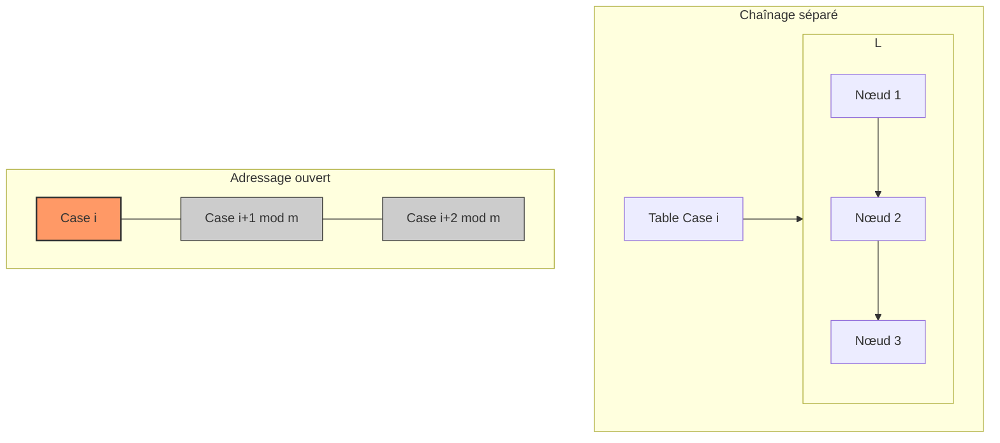

# Cours Avancé en Algorithmique — Séance 2 : Structures de données dynamiques avancées  
## Partie 2 : Théorie — Tables de Hachage (1h)  
### Contenu : Gestion des collisions (chaînage séparé, adressage ouvert - linéaire, quadratique)

---

## 1. Introduction à la gestion des collisions

Une **collision** survient dans une table de hachage lorsque deux clefs différentes produisent la même valeur de hachage, pointant vers un même indice dans la table. La gestion efficace de ces collisions est essentielle pour préserver la rapidité d’accès.

---

## 2. Chaînage séparé (Separate Chaining)

### Principe

Chaque case de la table contient une **liste chaînée** d’éléments. En cas de collision, les éléments sont ajoutés dans la liste de cette case.

- Les insertions et suppressions affectent uniquement la liste concernée.
- Le temps d’accès reste moyen \(O(1 + \alpha)\), \(\alpha\) étant le facteur de charge (nombre d’éléments/nombre de cases).

### Illustration en C simplifié

```c
typedef struct Node {
    char *key;
    int value;
    struct Node *next;
} Node;

Node *table[TABLE_SIZE];

void insert(char *key, int value) {
    unsigned int idx = hash(key);
    Node *new_node = malloc(sizeof(Node));
    new_node->key = strdup(key);
    new_node->value = value;
    new_node->next = table[idx];
    table[idx] = new_node;
}
```

### Avantages

- Facile à implémenter.
- Pratique en cas de facteur de charge > 1 (nombre d’éléments > taille table).
- Performant même dans le pire des cas (la recherche traverse uniquement la liste concernée).

---

## 3. Adressage ouvert (Open Addressing)

Les éléments sont stockés directement dans la table, sans listes externes. En cas de collision, on recherche une autre case "libre" selon une stratégie de **sondage**.

---

### 3.1 Sondage linéaire (Linear Probing)

- En cas de collision, on cherche la première case suivante vide (à l’indice `(h(k)+i) mod m` avec i=1,2,...).
- Recherche simple.
- Peut conduire à des regroupements appelés **clustering primaire**, dégradant les performances.

### Exemple d’insertion par sondage linéaire (pseudo-code)

```c
int linear_probing_insert(int table[], int m, int key) {
    int idx = hash(key);
    int i = 0;
    while (table[(idx + i) % m] != EMPTY) {
        i++;
    }
    table[(idx + i) % m] = key;
    return (idx + i) % m;
}
```

---

### 3.2 Sondage quadratique (Quadratic Probing)

- Variant réduisant le clustering primaire.
- La prochaine case testée est `(h(k) + c1*i + c2*i^2) mod m`, avec \(c_1, c_2\) constants.
- Permet meilleure dispersion des collisions, mais peut générer du clustering secondaire.

---

### 3.3 Double hachage (Double Hashing)

Une autre technique où la fonction de sondage utilise une deuxième fonction de hachage \(h_2(k)\), pour décaler plus efficacement.

---

## 4. Diagramme Mermaid — Illustration des méthodes de gestion de collision



---

## 5. Comparaison synthétique

| Méthode               | Mémoire supplémentaire | Complexité insertion | Gestion facteur de charge élevé | Implementation |
|-----------------------|------------------------|---------------------|---------------------------------|----------------|
| Chaînage séparé       | Oui (listes externes)   | \(O(1 + \alpha)\)   | Très bonne                      | Simple         |
| Adressage linéaire    | Non                    | \(O(1)\) (moyenne)  | Réduit efficacité au-delà de 0.7| Simple         |
| Adressage quadratique | Non                    | Plus élevé que linéaire| Meilleur que linéaire           | Moyennement simple |
| Double hachage        | Non                    | Très bonne          | Très bonne                      | Plus complexe  |

---

## 6. Limites et choix

- Le chaînage séparé facilite les redimensionnements dynamiques.
- L’adressage ouvert demande une table avec un facteur de charge < 1 pour éviter les performances dégradées.
- Le choix dépend du contexte : mémoire disponible, complexité, dimensionnement, type de clés.

---

## 7. Sources consultées

- [GeeksforGeeks — Collision Resolution Techniques](https://www.geeksforgeeks.org/collision-resolution-techniques-in-hashing/)
- [Wikipedia — Hash table](https://en.wikipedia.org/wiki/Hash_table#Collision_resolution)
- [Programiz — Hash Table Collision Handling](https://www.programiz.com/dsa/hash-table-collision-handling)
- [Open Addressing with Linear, Quadratic, Double Hashing](https://medium.com/@baphemot/understanding-hash-tables-better-6f7e0c1a87cd)

---

La gestion des collisions est la pierre angulaire des tables de hachage robustes. En fonction des contraintes mémoire et d’efficacité, chaînage ou adressage ouvert offrent des compromis adaptés.