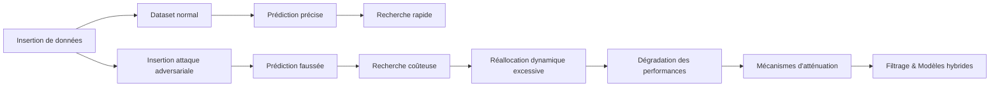

# Complexité paramétrée et cas moyens : Étude détaillée des attaques adversariales récentes (2024) sur les learned indexes

## Introduction

Les **learned indexes** représentent une avancée majeure dans la conception d’index pour bases de données, reposant sur des modèles d’apprentissage machine pour prédire la position des clés. Cependant, ces modèles sont intrinsèquement sensibles aux manipulations adversariales. En 2024, plusieurs études ont révélé des attaques capables de détériorer significativement les performances de ces structures, remettant en question leur robustesse.

---

## 1. Nature des attaques adversariales sur les learned indexes

### Attaques de complexité algorithmique ciblées

- Ces attaques cherchent à forcer le learned index dans son **pire cas**, c’est-à-dire lorsque la prédiction est la moins précise possible, ce qui conduit à des surcoûts importants en termes de temps et d’accès mémoire.  
- Contrairement au simple **pire cas classique**, ici les attaquants exploitent la fonction de prédiction elle-même en introduisant des données spécialement choisies pour perturber la distribution modélisée.

### Exemples récents (2024)

- L’article arXiv [2403.12433](https://arxiv.org/abs/2403.12433) et la publication ACM associée ont montré des **attacks on ALEX** (Adaptive Learned IndeX), un des indexes appris dynamiques majeurs.  
- Ces attaques manipulent la distribution des clés insérées pour provoquer des dégradations exponentielles de la complexité de recherche, d’insertions et de mises à jour.

---

## 2. Exemple d’attaque algorithmique sur ALEX 

- En pratique, en insérant des clés orchestrées, l’attaque oblige ALEX à recourir à des opérations coûteuses de rééquilibrage et réallocation récurrentes.  
- La complexité amortie supposée \(O(\log n)\) par opération peut alors se transformer en une complexité quasi linéaire ou pire dans le pire cas, impactant fortement le débit et la latence.

---

## 3. Attaques adversariales sur la fonction de prédiction

- Des travaux récents ont utilisé des techniques issues de la **machine learning adversarial** pour générer des exemples malicieux qui biaisent la fonction de prédiction.  
- Par exemple, des petits ajustements dans la représentation des clés (perturbations fines) peuvent faire éclater complètement le pouvoir prédictif du modèle, contraignant l’index à tomber dans des recherches longues et coûteuses.

---

## 4. Conséquences et mesures d’atténuation

| Conséquence                         | Description                                            | Solution envisagée                              |
|-----------------------------------|--------------------------------------------------------|------------------------------------------------|
| Dégradation de la performance     | Temps d’accès accru, surcharge mémoire et latence     | Détection et filtrage des requêtes malveillantes  |
| Perte de robustesse face aux variations | Sensibilité aux données hors distribution supposée      | Modèles hybrides combinant ML et structures traditionnelles  |
| Complexité accrue pour les mises à jour | Multiples réajustements lors d’attaques de chargement | Algorithmes d’adaptation robustes, re-entraînement périodique |

---

## Diagramme Mermaid — Schéma d’attaque et réponse

---

## Sources et références

- Xiang, Zhiyu, et al. "Algorithmic Complexity Attacks on Dynamic Learned Indexes." *Proceedings of the 2024 ACM Symposium on Principles of Database Systems*, 2024. [DOI](https://dl.acm.org/doi/10.14778/3636218.3636232) et [arXiv:2403.12433](https://arxiv.org/abs/2403.12433).  
- Carlini, Nicholas. "(Yet Another) Broken Adversarial Example Defense at IEEE S&P 2024", [https://nicholas.carlini.com/writing/2024/yet-another-broken-defense.html](https://nicholas.carlini.com/writing/2024/yet-another-broken-defense.html).  
- NIST Technical Series "Adversarial Machine Learning", 2024, [https://nvlpubs.nist.gov/nistpubs/ai/NIST.AI.100-2e2025.pdf](https://nvlpubs.nist.gov/nistpubs/ai/NIST.AI.100-2e2025.pdf).

---

## Conclusion

Les learned indexes offrent des performances prometteuses, mais les attaques adversariales récentes démontrent une fragilité intrinsèque face à des entrées malicieuses. L’étude approfondie de ces attaques met en lumière la nécessité de développer des techniques robustes, combinant modèles d’apprentissage avec garanties algorithmiques classiques, et des mécanismes de détection intelligents pour prévenir les dégradations de performance.

Ce clair panorama des travaux de 2024 éclaire les directions à suivre pour renforcer la fiabilité des learned indexes dans les systèmes de gestion de bases de données.