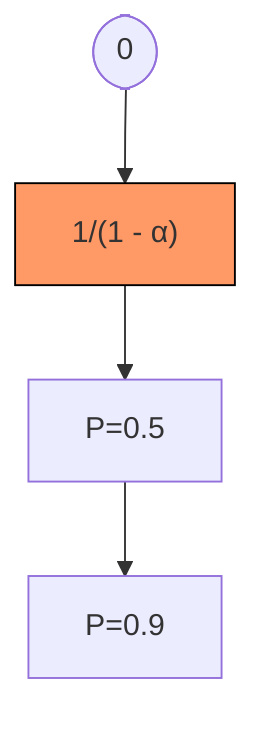
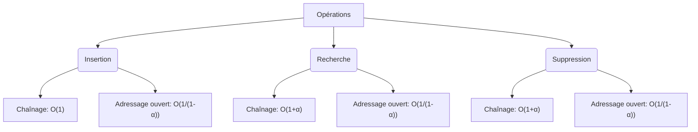

# Cours Avancé en Algorithmique — Séance 2 : Structures de données dynamiques avancées  
## Partie 2 : Théorie — Tables de Hachage (1h)  
### Contenu : Complexité des opérations (insertion, recherche, suppression)

---

## 1. Introduction

Les tables de hachage sont conçues pour offrir un accès rapide en moyenne, proche de \(O(1)\). Cependant, la complexité des opérations dépend fortement du comportement de la fonction de hachage et de la gestion des collisions.

---

## 2. Facteur de charge \(\alpha\)

Le facteur de charge \(\alpha = \frac{n}{m}\) est le rapport entre le nombre d’éléments \(n\) stockés et la taille \(m\) de la table. Il représente la densité d’occupation.

- Un \(\alpha\) faible (ex : 0.5) favorise des performances optimales.
- Un \(\alpha\) proche de 1 ou plus dégrade les performances, surtout avec adressage ouvert.

---

## 3. Complexité en chaînage séparé

| Opération   | Complexité moyenne  | Complexité pire cas                     |
|-------------|--------------------|---------------------------------------|
| Insertion   | \(O(1)\)           | \(O(n)\) (tous éléments dans une liste)       |
| Recherche   | \(O(1 + \alpha)\)  | \(O(n)\)                              |
| Suppression | \(O(1 + \alpha)\)  | \(O(n)\)                              |

### Explication

- Les opérations accèdent à la liste chaînée correspondant à l’indice calculé.
- Moyenne linéaire en \(\alpha\), pire cas linéaire en \(n\) (si fonction de hachage catastrophique).

---

## 4. Complexité en adressage ouvert

| Opération   | Complexité moyenne         | Complexité pire cas            |
|-------------|---------------------------|-------------------------------|
| Insertion   | \(O\left(\frac{1}{1-\alpha}\right)\) | \(O(n)\) en cas de tableau plein      |
| Recherche   | \(O\left(\frac{1}{1-\alpha}\right)\) | \(O(n)\)                      |
| Suppression | \(O\left(\frac{1}{1-\alpha}\right)\) | \(O(n)\)                      |

### Explication

- Plus le facteur de charge se rapproche de 1, plus le temps moyen augmente de façon exponentielle.
- Les sondages linéaire, quadratique, et double hachage impactent les performances.

---

## 5. Graphique illustratif — Complexité en fonction du facteur de charge

*Note : la fonction \( \frac{1}{1-\alpha} \) illustre la croissance du coût avec \(\alpha\).*

---

## 6. Exemples concrets

### Exemple 1 — Recherche en chaînage

Dans une table de taille 10, 5 éléments insérés (\(\alpha=0.5\)), la recherche moyenne inspecte en moyenne \(1 + 0.5 = 1.5\) éléments par case.

### Exemple 2 — Insertion en adressage linéaire

Si \(\alpha=0.8\), le nombre moyen de sondages avant insertion est approximativement \(\frac{1}{1-0.8} = 5\), donc 5 accès mémoire en moyenne avant l’insertion.

---

## 7. Diagramme — schéma opérationnel et complexité

---

## 8. Impact du choix de la fonction de hachage

- Une fonction de hachage bien conçue limite le nombre de collisions, réduisant \(\alpha\) effectif.
- Un mauvais hachage concentre les éléments, dégradant la complexité vers \(O(n)\).

---

## 9. Sources consultées

- [GeeksforGeeks — Time Complexity of Hashing](https://www.geeksforgeeks.org/time-complexity-of-hashing-in-hashing-data-structure/)
- [Wikipedia — Hash Table#Complexity_of_hash_tables](https://en.wikipedia.org/wiki/Hash_table#Complexity_of_hash_tables)
- [Programiz — Hash Table Analysis](https://www.programiz.com/dsa/hash-table)
- [MIT Lecture Notes — Hashing Performance](https://ocw.mit.edu/courses/6-006-introduction-to-algorithms-fall-2011/resources/lec10/)

---

La réalité d’une table de hachage performante repose sur le contrôle du facteur de charge et la qualité de la fonction de hachage. Ces paramètres déterminent directement le coût en temps moyen et en pire cas des opérations.
