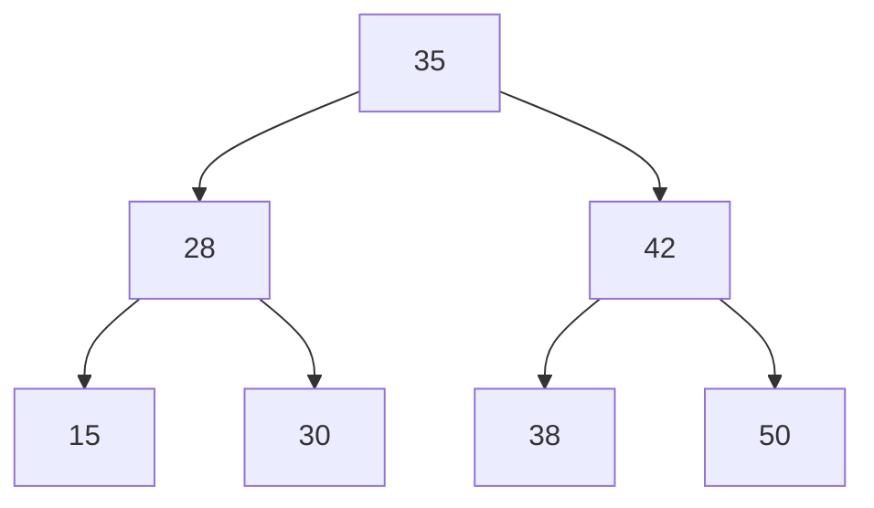

# Cours Avancé en Algorithmique — Séance 3 : Arbres binaires et arbres équilibrés  
## Partie 1 : Théorie — Arbres Binaires de Recherche (ABR) (1.5h)  
### Contenu : Définition et propriétés des ABR

---

## 1. Définition d’un Arbre Binaire de Recherche (ABR)

Un **Arbre Binaire de Recherche (Binary Search Tree, BST)** est une structure de données arborescente qui remplit les conditions suivantes :

- Chaque nœud contient une clé (valeur unique ou non selon contexte).
- Pour chaque nœud \(N\), toutes les clés dans son sous-arbre gauche sont strictement inférieures à la clé de \(N\).
- Toutes les clés dans son sous-arbre droit sont supérieures à la clé de \(N\).
- Chaque nœud a au plus deux enfants : un enfant gauche et un enfant droit.

---

## 2. Propriétés fondamentales

| Propriété                         | Description                                         |
|----------------------------------|-----------------------------------------------------|
| **Recherche efficace**            | En moyenne, les opérations (recherche, insertion, suppression) prennent un temps proportionnel à la hauteur \(h\).    |
| **Ordre des clés**                | Le parcours infixe (in-order) d’un ABR retourne les clés dans l’ordre croissant. |
| **Hauteur variable**              | Dépend de l’ordre d’insertion, variant de \(\log n\) (arbre équilibré) à \(n\) (arbre dégénéré) pour \(n\) nœuds. |
| **Structure récursive**           | Chaque sous-arbre est lui-même un ABR.              |

---

## 3. Conséquences des propriétés

- La propriété d’ordre sur les sous-arbres permet des algorithmes récursifs simples pour rechercher, insérer ou supprimer.
- La complexité dépend fortement de la hauteur de l’arbre.
- Des arbres non équilibrés peuvent se comporter comme des listes chaînées (temps linéaire).

---

## 4. Exemple simple d’un ABR

Insérer successivement les clés : 35, 28, 42, 15, 30, 38, 50

```plaintext
        35
       /  \
     28    42
    /  \   / \
  15   30 38 50
```

---

## 5. Algorithme de recherche dans un ABR (pseudo-code)

```c
Node* rechercher(Node *root, int key) {
    if (root == NULL || root->key == key)
        return root;

    if (key < root->key)
        return rechercher(root->left, key);
    else
        return rechercher(root->right, key);
}
```

---

## 6. Parcours infixe — extraction des clés triées

```c
void parcours_infixe(Node *root) {
    if (root != NULL) {
        parcours_infixe(root->left);
        printf("%d ", root->key);
        parcours_infixe(root->right);
    }
}
```

---

## 7. Diagramme Mermaid — structure typique d’un ABR



---

## 8. Points à surveiller

- L’ordre d’insertion est déterminant pour la forme de l’arbre.
- L’équilibrage est nécessaire en pratique pour garantir \(O(\log n)\) dans le pire cas (voir arbres AVL, rouges-noirs).
- La suppression nécessite la gestion soigneuse des cas (nœud feuille, nœud avec 1 ou 2 enfants).

---

## 9. Sources consultées

- [GeeksforGeeks — Binary Search Tree (BST)](https://www.geeksforgeeks.org/binary-search-tree-data-structure/)
- [Wikipedia — Binary Search Tree](https://en.wikipedia.org/wiki/Binary_search_tree)
- [TutorialsPoint — Binary Search Tree](https://www.tutorialspoint.com/data_structures_algorithms/binary_search_tree_algo.htm)
- [Programiz — Binary Search Tree](https://www.programiz.com/dsa/binary-search-tree)

---

Un ABR est une base essentielle en algorithmique servant de fondation pour des structures plus complexes. Son organisation garantit un accès ordonné efficace dès lors que la hauteur est maîtrisée.