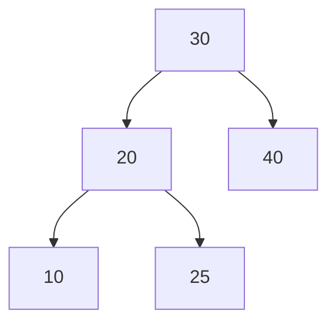
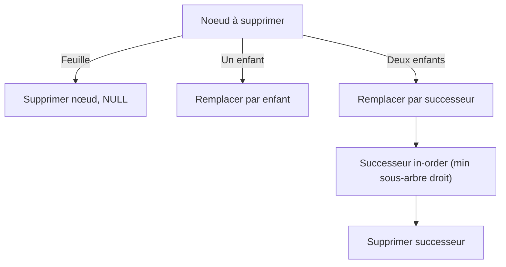

# Cours Avancé en Algorithmique — Séance 3 : Arbres binaires et arbres équilibrés  
## Partie 1 : Théorie — Arbres Binaires de Recherche (ABR) (1.5h)  
### Contenu : Opérations fondamentales : insertion, recherche, suppression (cas simples et complexes)

---

## 1. Introduction

L’**Arbre Binaire de Recherche (ABR)** est structuré pour maintenir l’ordre des données tout en permettant des opérations efficaces. Les trois opérations fondamentales sont :

- Recherche
- Insertion
- Suppression

Dans cette section, chaque opération sera détaillée avec ses cas particuliers et illustrations.

---

## 2. Recherche dans un ABR

L’opération de recherche exploite la propriété du BST : chaque nœud sépare les clés plus petites (à gauche) et les plus grandes (à droite).

### Algorithme (récursif)

- Si l’arbre est vide, élément non trouvé.
- Si la clé recherchée égale la clé du nœud courant, retourner le nœud.
- Si clé < clé nœud, rechercher dans le sous-arbre gauche.
- Sinon, dans le sous-arbre droit.

### Code en C

```c
Node* recherche(Node *root, int key) {
    if (root == NULL || root->key == key)
        return root;

    if (key < root->key)
        return recherche(root->left, key);
    else
        return recherche(root->right, key);
}
```

### Complexité

- Moyenne : \(O(\log n)\) si arbre équilibré.
- Pire cas : \(O(n)\) si arbre dégénéré (liste).

---

## 3. Insertion dans un ABR

L’insertion respecte la structure du BST en plaçant la nouvelle clé à une feuille.

### Algorithme

- Si arbre vide, créer un nouveau nœud.
- Comparer la clé avec la racine.
- Insertion récursive à gauche si clé < racine, sinon à droite.

### Exemple d’insertion (pseudo-code)

```c
Node* inserer(Node* root, int key) {
    if (root == NULL)
        return creer_nouveau_noeud(key);
    if (key < root->key)
        root->left = inserer(root->left, key);
    else if (key > root->key)
        root->right = inserer(root->right, key);
    return root;
}
```

### Illustration d’une insertion

Insérer `25` dans l’arbre initial :



---

## 4. Suppression dans un ABR

La suppression est la plus délicate des opérations en raison des différents cas à gérer.

### 4.1 Cas 1 : Le nœud est une feuille (pas d’enfant)

- Supprimer simplement le nœud, le parent pointe vers NULL.

### 4.2 Cas 2 : Le nœud a un seul enfant

- Le parent relie directement cet enfant, supprimant le nœud.

### 4.3 Cas 3 : Le nœud a deux enfants

- Trouver le successeur ou prédécesseur in-order (le plus petit nœud du sous-arbre droit ou le plus grand ds sous-arbre gauche).
- Remplacer la clé du nœud supprimé par la clé de ce successeur/prédécesseur.
- Supprimer récursivement le successeur/prédécesseur.

### Code C simplifié (suppression)

```c
Node* supprimer(Node* root, int key) {
    if (root == NULL) return root;

    if (key < root->key)
        root->left = supprimer(root->left, key);
    else if (key > root->key)
        root->right = supprimer(root->right, key);
    else {
        // Cas nœud avec 0 ou 1 enfant
        if (root->left == NULL) {
            Node* temp = root->right;
            free(root);
            return temp;
        } else if (root->right == NULL) {
            Node* temp = root->left;
            free(root);
            return temp;
        }

        // Cas 2 enfants : récupère le successeur in-order
        Node* temp = minValueNode(root->right);
        root->key = temp->key;
        root->right = supprimer(root->right, temp->key);
    }
    return root;
}

Node* minValueNode(Node* node) {
    Node* current = node;
    while (current && current->left != NULL)
        current = current->left;
    return current;
}
```

---

## 5. Diagramme — Illustration des cas de suppression



---

## 6. Résumé des complexités

| Opération  | Temps moyen          | Pire cas           |
|------------|---------------------|--------------------|
| Recherche  | \(O(\log n)\)       | \(O(n)\)           |
| Insertion  | \(O(\log n)\)       | \(O(n)\)           |
| Suppression| \(O(\log n)\)       | \(O(n)\)           |

---

## 7. Sources consultées

- [GeeksforGeeks — BST operations](https://www.geeksforgeeks.org/binary-search-tree-set-1-search-and-insertion/)
- [Wikipedia — Binary search tree#Deletion](https://en.wikipedia.org/wiki/Binary_search_tree#Deletion)
- [Programiz — BST operations](https://www.programiz.com/dsa/binary-search-tree)
- [TutorialsPoint — BST Deletion](https://www.tutorialspoint.com/data_structures_algorithms/binary_search_tree_algorithms.htm)

---

Les opérations sur un ABR nécessitent une bonne compréhension des cas pour insertion et surtout suppression. La maîtrise de ces algorithmes garantit une manipulation efficace et cohérente de la structure.
