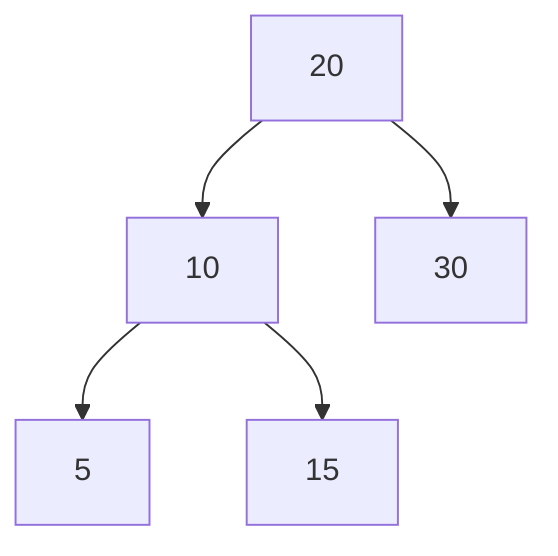
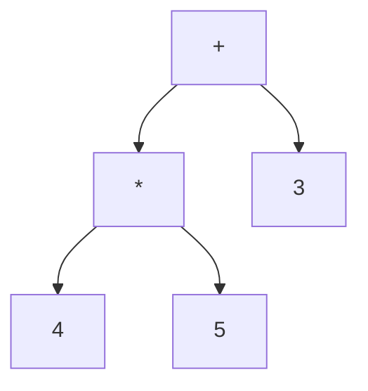
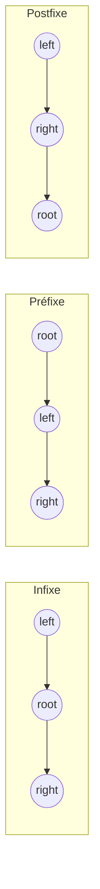

# Cours Avancé en Algorithmique — Séance 3 : Arbres binaires et arbres équilibrés  
## Partie 1 : Théorie — Arbres Binaires de Recherche (ABR) (1.5h)  
### Contenu : Parcours d’arbres (infixe, préfixe, postfixe) : applications

---

## 1. Introduction aux parcours d’arbres

Un **parcours d’arbre** consiste à visiter tous les nœuds selon un ordre donné. Pour les arbres binaires, il existe principalement trois parcours classiques :

- **Infixe (In-order)**
- **Préfixe (Pre-order)**
- **Postfixe (Post-order)**

Chacun a ses usages et propriétés.

---

## 2. Parcours infixe (In-order)

### Définition

Visite le sous-arbre gauche, puis le nœud courant, puis le sous-arbre droit.

### Algorithme récursif

```c
void inOrder(Node *root) {
    if (root != NULL) {
        inOrder(root->left);
        printf("%d ", root->key);
        inOrder(root->right);
    }
}
```

### Propriété importante

- Pour un **ABR**, le parcours infixe restitue les clés dans l’ordre **croissant**.

### Exemple



Parcours infixe : 5 10 15 20 30

---

## 3. Parcours préfixe (Pre-order)

### Définition

Visite le nœud courant, puis le sous-arbre gauche, enfin le sous-arbre droit.

### Algorithme récursif

```c
void preOrder(Node *root) {
    if (root != NULL) {
        printf("%d ", root->key);
        preOrder(root->left);
        preOrder(root->right);
    }
}
```

### Application

- Sauvegarde ou clonage d’un arbre.
- Évaluation d’expressions en notation préfixe.

---

## 4. Parcours postfixe (Post-order)

### Définition

Visite le sous-arbre gauche, le sous-arbre droit, puis le nœud courant.

### Algorithme récursif

```c
void postOrder(Node *root) {
    if (root != NULL) {
        postOrder(root->left);
        postOrder(root->right);
        printf("%d ", root->key);
    }
}
```

### Application

- Suppression ou libération d’un arbre (on libère d’abord les fils).
- Évaluation d’expressions en notation postfixe.

---

## 5. Applications concrètes des parcours

| Parcours   | Usage principal                                 |
|------------|------------------------------------------------|
| Infixe     | Récupérer les données triées dans un ABR       |
| Préfixe    | Copier un arbre, générer une expression préfixe|
| Postfixe   | Libération mémoire, évaluation expression postfixe|

---

## 6. Exemple d’utilisation : Expression arithmétique

Arbre d’expression représentant : \((3 + (4 \times 5))\)



- Parcours préfixe : `+ 3 * 4 5`  
- Parcours infixe : `3 + 4 * 5` (respecte la priorité)  
- Parcours postfixe : `3 4 5 * +`

---

## 7. Diagramme Mermaid — synthèse des parcours



---

## 8. Complexité

Tous les parcours visitent chaque nœud exactement une fois, donc la complexité est linéaire en nombre de nœuds :

\[
O(n)
\]

---

## 9. Sources consultées

- [GeeksforGeeks — Tree traversal](https://www.geeksforgeeks.org/tree-traversals-inorder-preorder-and-postorder/)
- [Wikipedia — Tree traversal](https://en.wikipedia.org/wiki/Tree_traversal#Depth-first_search)
- [Programiz — Tree Traversal](https://www.programiz.com/dsa/tree-traversal)
- [Visualgo — Tree traversals](https://visualgo.net/en/dfsbfs)

---

Les parcours d’arbres sont des outils indispensables pour exploiter la structure des ABR, qu’il s’agisse d’accéder aux données triées, d’opérer sur des expressions ou de gérer la mémoire.