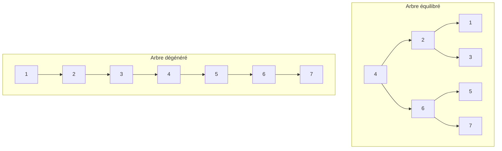

# Cours Avancé en Algorithmique — Séance 3 : Arbres binaires et arbres équilibrés  
## Partie 1 : Théorie — Arbres Binaires de Recherche (ABR) (1.5h)  
### Contenu : Analyse de complexité des opérations

---

## 1. Introduction

L'efficacité des opérations sur un Arbre Binaire de Recherche (ABR) dépend grandement de sa **hauteur** \(h\). Les principaux facteurs à analyser sont les **recherches**, **insertions** et **suppression**.

---

## 2. Hauteur de l’ABR et impact sur les opérations

- La hauteur \(h\) de l’arbre est la longueur maximale du chemin de la racine vers une feuille.
- Les opérations parcourent au maximum un chemin racine-feuille, donc le temps dépend de \(h\).
- L’objectif est d’obtenir \(h = O(\log n)\) pour un arbre équilibré, où \(n\) est le nombre de nœuds.
- Sans contrôle, l’arbre peut devenir dégénéré en liste chaînée, donc \(h = O(n)\).

---

## 3. Analyse de complexité des opérations

| Opération  | Complexité moyenne     | Pire cas               |
|------------|-----------------------|------------------------|
| Recherche  | \(O(\log n)\)          | \(O(n)\)               |
| Insertion  | \(O(\log n)\)          | \(O(n)\)               |
| Suppression| \(O(\log n)\)          | \(O(n)\)               |

---

### Explications

- **Recherche** : On compare successivement les clés en descendant d'une hauteur au plus \(h\).
- **Insertion** : Elle suit la même logique que la recherche pour trouver la position d'insertion.
- **Suppression** : Inclut recherche + ajustement (cas complexe quand le nœud a deux enfants).

---

## 4. Exemple d’évolution de la hauteur

Considérons deux séquences d’insertion dans un ABR vide :

- Cas optimal (éléments insérés par ordre équilibré) :  
  \(1, 5, 3, 7, 2, 6, 4\)  
  Arbre équilibré, hauteur \(\approx \log_2 n\).

- Cas pire (éléments insérés en ordre croissant) :  
  \(1, 2, 3, 4, 5, 6, 7\)  
  Arbre linéaire, hauteur \(n\).

---

## 5. Diagramme Mermaid — arbre équilibré vs arbre dégénéré

---

## 6. Influence de l’équilibrage

- La hauteur \(\Theta(\log n)\) garantit la complexité logarithmique.
- Les ABR non équilibrés ont des coûts linéaires.
- D’où l’intérêt des arbres équilibrés (AVL, rouges-noirs) pour garantir une hauteur logarithmique.

---

## 7. Comparaison avec d’autres structures

| Structure            | Recherche          | Insertion         | Suppression       |
|----------------------|--------------------|-------------------|-------------------|
| ABR non équilibré    | \(O(n)\)           | \(O(n)\)          | \(O(n)\)          |
| ABR équilibré (AVL)   | \(O(\log n)\)      | \(O(\log n)\)     | \(O(\log n)\)     |
| Table de hachage     | \(O(1)\) (moyenne) | \(O(1)\)          | \(O(1)\)          |

---

## 8. Sources consultées

- [GeeksforGeeks — BST Operations Time Complexity](https://www.geeksforgeeks.org/binary-search-tree-set-1-search-and-insertion/)
- [Wikipedia — Binary Search Tree#Time_complexity](https://en.wikipedia.org/wiki/Binary_search_tree#Time_complexity)
- [Programiz — Binary Search Tree](https://www.programiz.com/dsa/binary-search-tree)
- [MIT - Lecture Notes on BST](https://ocw.mit.edu/courses/6-006-introduction-to-algorithms-fall-2011/resources/lec09/)

---

Pour exploiter pleinement le potentiel d’un ABR, il est indispensable de comprendre que la hauteur conditionne la complexité des opérations. La gestion efficace de l’équilibre est la clé pour maintenir un comportement performant.