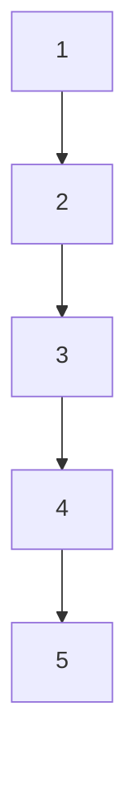
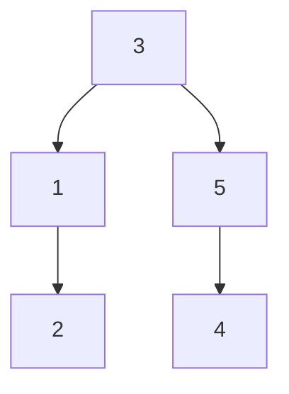
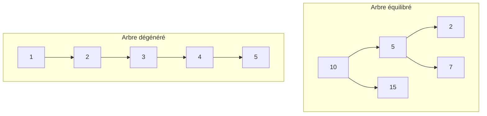

# Cours Avancé en Algorithmique — Séance 3 : Arbres binaires et arbres équilibrés  
## Partie 2 : Théorie — Introduction aux Arbres Équilibrés (1h)  
### Contenu : Problème des ABR dégénérés

---

## 1. Rappel sur les Arbres Binaires de Recherche (ABR)

Un ABR organise les données pour permettre la recherche, l’insertion et la suppression en temps souvent logarithmique dans le meilleur des cas. La clé du succès réside dans la **hauteur** de l’arbre.

---

## 2. Définition du problème des ABR dégénérés

Un ABR dégénéré est un arbre dont la structure approche celle d’une liste chaînée. Concrètement :

- Chaque nœud n’a qu’un seul enfant (gauche ou droite).
- La hauteur \(h\) de l’arbre est alors linéaire en nombre de nœuds \(n\), soit \(h=O(n)\).
- Les opérations deviennent aussi coûteuses que dans une liste chaînée.

**Origine** : Ce cas survient généralement quand on insère des clés dans un ordre croissant ou décroissant sans rééquilibrage.

---

## 3. Conséquences pratiques

| Aspect                  | ABR équilibré       | ABR dégénéré    |
|-------------------------|---------------------|-----------------|
| Hauteur \(h\)           | \(O(\log n)\)       | \(O(n)\)        |
| Complexité recherche    | \(O(\log n)\)       | \(O(n)\)        |
| Complexité insertion    | \(O(\log n)\)       | \(O(n)\)        |
| Complexité suppression  | \(O(\log n)\)       | \(O(n)\)        |

---

## 4. Exemple illustratif

### Insertion dans l’ordre croissant

Insérer successivement les clés \(1, 2, 3, 4, 5\) dans un ABR vide crée :

La structure est une « liste » verticale, la hauteur est égale au nombre de nœuds.

### Insertion dans un ordre « équilibré »

Insertion de \(3, 1, 5, 2, 4\) donne :

Hauteur plus faible, structure équilibrée.

---

## 5. Illustration de temps d’accès (conceptualisation)

- Recherche dans équilibré : suit chemins courts.
- Recherche dans dégénéré : suit tous les nœuds (linéaire).

---

## 6. Origine des ABR dégénérés

L’absence de stratégie de rééquilibrage conduit à cette dégradation :

- Insertions triées croissantes/décroissantes,
- Suppressions incorrectes sans rééquilibrage.

---

## 7. Solutions : introduction aux arbres équilibrés

Pour pallier ce problème, des structures d’arbres auto-équilibrés existent, où l’arbre s’adapte au fur et à mesure des modifications pour maintenir

\[
h = O(\log n)
\]

Exemples : arbres AVL, arbres rouges-noirs, arbres B.

---

## 8. Sources consultées

- [GeeksforGeeks — BST degenerated](https://www.geeksforgeeks.org/binary-search-tree-set-1-search-and-insertion/#Degenerated_Tree)
- [Wikipedia — Binary Search Tree#Degenerate tree](https://en.wikipedia.org/wiki/Binary_search_tree#Degenerate_tree)
- [Programiz — BST Problems](https://www.programiz.com/dsa/binary-search-tree)
- [Coursera Algorithms — Tree height and balance](https://www.coursera.org/lecture/data-structures/height-of-a-bst-BmOxc)

---

La notion de dégénérescence dans un ABR révèle ses limites sans mécanismes d’équilibrage. Cette contrainte motive le développement d’arbres équilibrés pour garantir des performances stables et efficaces sur de larges données.