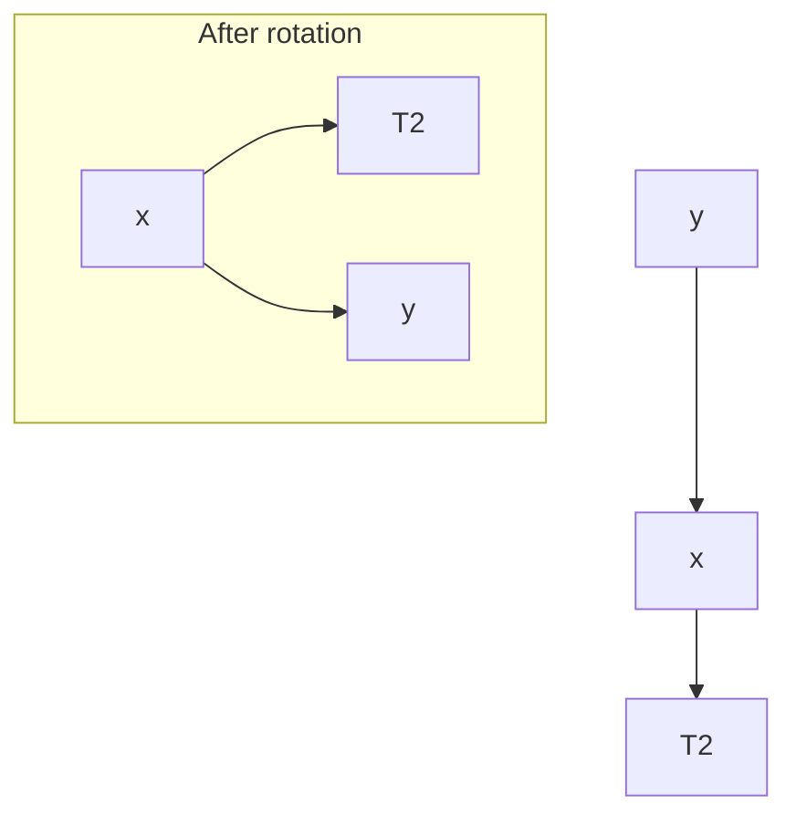

# Cours Avancé en Algorithmique — Séance 3 : Arbres binaires et arbres équilibrés  
## Partie 2 : Théorie — Introduction aux Arbres Équilibrés (1h)  
### Contenu : Principe de l’équilibrage : pourquoi et comment

---

## 1. Pourquoi équilibrer un Arbre Binaire de Recherche (ABR) ?

### Problème fondamental

- Un ABR peut devenir dégénéré, c’est-à-dire ressembler à une liste chaînée, lorsque les données sont insérées dans un ordre trié.
- Cette dégénérescence entraîne une hauteur \(h = O(n)\), où \(n\) est le nombre de nœuds.
- Les opérations (recherche, insertion, suppression) deviennent alors linéaires \((O(n))\) au lieu de logarithmiques \((O(\log n))\).

### Objectif de l’équilibrage

Assurer que la hauteur d’un arbre reste proportionnelle à \(\log n\) pour garantir un temps d’accès efficace, quel que soit l’ordre d’insertion.

---

## 2. Qu’est-ce que l’équilibrage ?

L’**équilibrage** est un ensemble de techniques qui maintiennent la structure de l’arbre pour éviter qu’elle ne devienne trop déséquilibrée.

### Mesure de l’équilibre

- La différence de hauteur entre les sous-arbres gauche et droit d’un nœud.
- Par exemple, pour un arbre AVL, cette différence (appelée facteur d’équilibre) doit être strictement comprise entre -1 et +1.

---

## 3. Comment équilibrer un ABR ? Les méthodes générales

### 3.1 Réorganisation au cours des opérations

- Après insertion ou suppression, l’arbre vérifie son équilibre.
- Si déséquilibré, des opérations spécifiques, dites **rotations**, sont appliquées pour restaurer l’équilibre.

### 3.2 Rotations

Ce sont des opérations locales qui changent la structure de l’arbre sans violer la propriété BST.

| Type de rotation    | Description                                |
|---------------------|--------------------------------------------|
| Rotation simple gauche  | Rééquilibre un sous-arbre lourd à droite  |
| Rotation simple droite  | Rééquilibre un sous-arbre lourd à gauche  |
| Rotation double gauche-droite | Combinaison de rotations          |
| Rotation double droite-gauche | Combinaison inverse             |

---

## 4. Exemple concret : Rotation droite

Illustrons une rotation droite sur un nœud \(y\) dont le sous-arbre gauche \(x\) est lourd :



Cette rotation diminue la hauteur du côté gauche plus lourd, rééquilibrant ainsi l’arbre.

---

## 5. Types d’arbres équilibrés populaires

| Type        | Méthode d’équilibrage                    | Caractéristiques                       |
|-------------|-----------------------------------------|--------------------------------------|
| Arbre AVL   | Maintien facteur d’équilibre \(-1, 0, 1\) | Rotations fréquentes, très strict    |
| Arbre Rouge-Noir | Couleur des nœuds et propriétés spécifiques | Plus souple, opérations plus amorties|

---

## 6. Impact sur la complexité

Après équilibrage :

- La hauteur \(h\) est garantie dans \(O(\log n)\).
- Les opérations de recherche, insertion et suppression ont alors une complexité \(O(\log n)\).

---

## 7. Synthèse par diagramme Mermaid — Opération d’équilibrage après insertion

```mermaid
graph TD
    Insert[Insertion]
    Insert --> Check[Contrôle d'équilibre]
    Check -->|OK| Done[Fin]
    Check -->|Déséquilibré| Rotation[Rotation(s) de rééquilibrage]
    Rotation --> Done
```

---

## 8. Sources consultées

- [GeeksforGeeks — AVL Tree](https://www.geeksforgeeks.org/avl-tree-set-1-insertion/)
- [Wikipedia — Self-balancing binary search tree](https://en.wikipedia.org/wiki/Self-balancing_binary_search_tree)
- [Programiz — AVL Tree Rotations](https://www.programiz.com/dsa/avl-tree)
- [TutorialsPoint — Red-Black Tree](https://www.tutorialspoint.com/data_structures_algorithms/red_black_tree_algorithm.htm)

---

Maintenir un arbre équilibré est la clé pour préserver l’efficacité des opérations sur un ABR. L’introduction des rotations et autres mécanismes automatiques permet à la structure de s’adapter dynamiquement, garantissant des performances optimales.