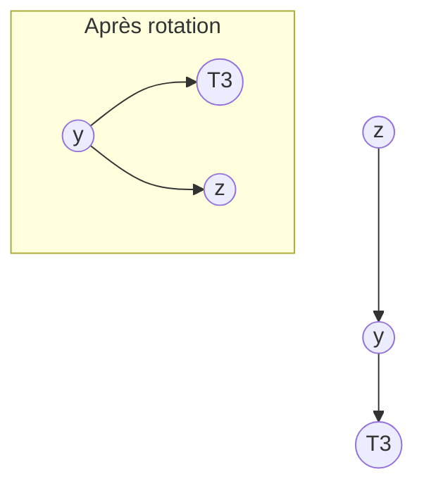
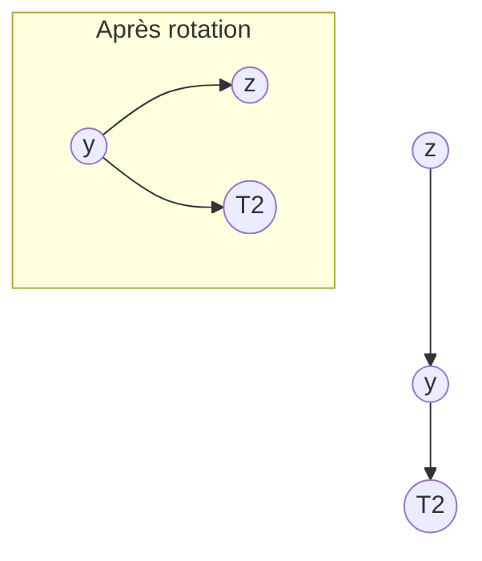

# Cours Avancé en Algorithmique — Séance 3 : Arbres binaires et arbres équilibrés  
## Partie 2 : Théorie — Introduction aux Arbres Équilibrés (1h)  
### Contenu : Introduction aux arbres AVL (facteur d'équilibre, rotations - présentation)

---

## 1. Définition des arbres AVL

Les arbres **AVL** (nommés d'après leurs inventeurs Adelson-Velskiĭ et Landis, 1962) sont des arbres binaires de recherche auto-équilibrés qui garantissent que la hauteur du sous-arbre gauche et du sous-arbre droit de chaque nœud diffère d'au plus 1.

---

## 2. Facteur d'équilibre (Balance Factor)

- Pour chaque nœud \(n\), on définit son **facteur d’équilibre** comme :

\[
FE(n) = \text{hauteur}(sous\_arbre\_gauche) - \text{hauteur}(sous\_arbre\_droit)
\]

- Un arbre est AVL si pour tout nœud \(n\) :

\[
FE(n) \in \{-1,\,0,\,1\}
\]

- Si \(FE(n)\) sort de cet intervalle, l'arbre est déséquilibré en ce nœud.

---

## 3. Pourquoi ce facteur ?

- Il mesure localement l’équilibre.
- Cela permet une détection rapide des déséquilibres suivant les insertions ou suppressions.
- Corriger ces déséquilibres maintient une hauteur logarithmique \(\approx O(\log n)\).

---

## 4. Rotations dans les arbres AVL

Les rotations sont les opérations fondamentales qui corrigent les déséquilibres dans un arbre AVL. Elles sont effectuées localement autour du nœud déséquilibré.

### Types de rotations

| Rotation          | Description                                      | Illustration Mermaid                   |
|-------------------|-------------------------------------------------|--------------------------------------|
| **Rotation Simple Droite (RR)**   | Corrige un déséquilibre causé par insertion à gauche du sous-arbre gauche | Voir section 5                     |
| **Rotation Simple Gauche (LL)**   | Corrige un déséquilibre causé par insertion à droite du sous-arbre droit | Voir section 6                     |
| **Rotation Double Gauche-Droite (LR)** | Déséquilibre causé par insertion à droite du sous-arbre gauche | Combinaison: rotation gauche + droite |
| **Rotation Double Droite-Gauche (RL)** | Déséquilibre causé par insertion à gauche du sous-arbre droit | Combinaison: rotation droite + gauche |

---

## 5. Rotation simple droite (RR)

- Utilisée si le facteur d’équilibre d’un nœud \(z\) est \(+2\) et que celui de son fils gauche \(y\) est \(+1\).
- On effectue une rotation droite autour de \(z\):



---

## 6. Rotation simple gauche (LL)

- Utilisée si le facteur d’équilibre de \(z\) est \(-2\) et celui de son fils droit \(y\) est \(-1\).
- On effectue une rotation gauche autour de \(z\):



---

## 7. Rotations doubles (LR et RL)

Ces rotations sont utilisées quand le déséquilibre est causé par une insertion sur le sous-arbre opposé du fils du nœud déséquilibré.

### 7.1 Rotation double gauche-droite (LR)

- Déséquilibre: \(FE(z) = +2\) et \(FE(y) = -1\)
- Procédure:
    1. Rotation gauche sur \(y\)
    2. Rotation droite sur \(z\)

### 7.2 Rotation double droite-gauche (RL)

- Déséquilibre: \(FE(z) = -2\) et \(FE(y) = +1\)
- Procédure:
    1. Rotation droite sur \(y\)
    2. Rotation gauche sur \(z\)

---

## 8. Exemple d’arbre AVL avec insertion et rotation

Considérons l'insertion successive des clés suivantes : 10, 20, 30 dans un ABR vide.

- Après insertion de 10 et 20, l’arbre est équilibré.
- Insertion de 30 crée un déséquilibre avec \(FE(10) = -2\).
- Une rotation simple gauche (LL) est faite au nœud 10.

```mermaid
graph TD
    subgraph Avant rotation
        Z10[10]
        Z10 --> _[ ] --> Y20[20]
        Y20 --> _[ ] --> X30[30]
    end

    subgraph Après rotation gauche (LL)
        Y20[20]
        Y20 --> Z10[10]
        Y20 --> X30[30]
    end
```

---

## 9. Complexité des opérations dans les arbres AVL

Toutes les opérations fondamentales (recherche, insertion, suppression) s’exécutent en temps :

\[
O(\log n)
\]

grâce à la garantie d’une hauteur logarithmique.

---

## 10. Sources consultées

- [GeeksforGeeks — AVL Tree](https://www.geeksforgeeks.org/avl-tree-set-1-insertion/)
- [Wikipedia — AVL Tree](https://en.wikipedia.org/wiki/AVL_tree)
- [Programiz — AVL Tree](https://www.programiz.com/dsa/avl-tree)
- [TutorialsPoint — AVL Tree Insertions and Rotations](https://www.tutorialspoint.com/data_structures_algorithms/avl_tree_algorithms.htm)

---

La structure de l’arbre AVL, basée sur le facteur d’équilibre et ses rotations, garantit une auto-réorganisation dynamique. Cette propriété préserve les performances optimales sur toutes les opérations de l’arbre binaire de recherche.