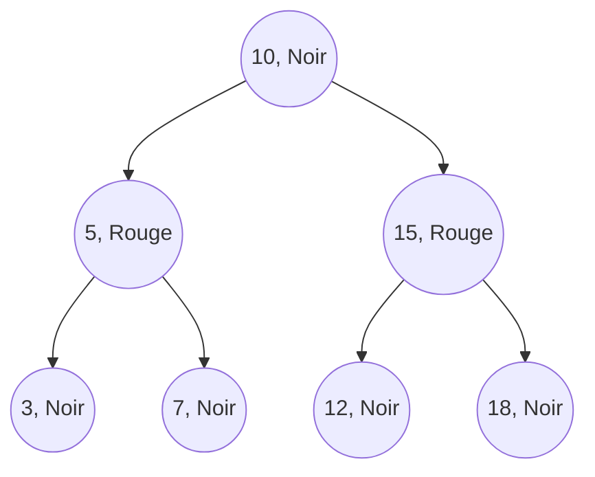
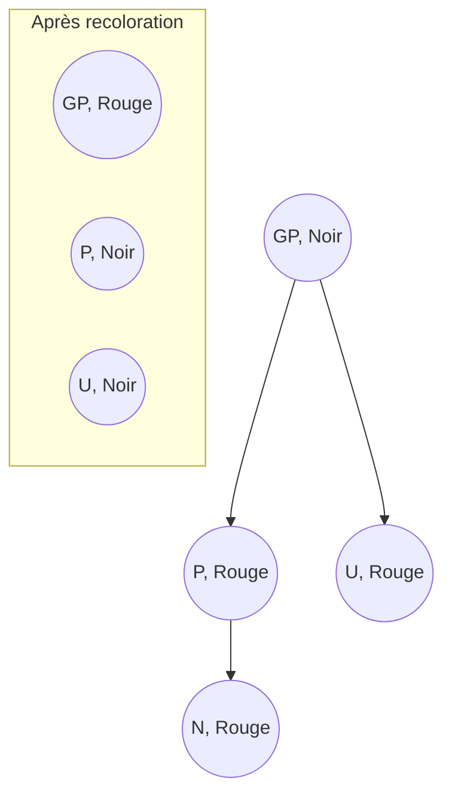
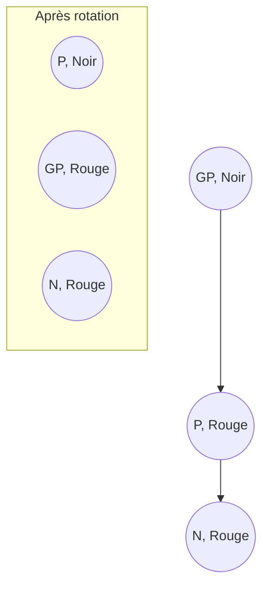

# Cours Avancé en Algorithmique — Séance 3 : Arbres binaires et arbres équilibrés  
## Partie 2 : Théorie — Introduction aux Arbres Équilibrés (1h)  
### Contenu : Introduction aux arbres Rouge-Noir (propriétés, exemples de rééquilibrage)

---

## 1. Présentation générale des arbres Rouge-Noir

Un **arbre Rouge-Noir (RN)** est un arbre binaire de recherche auto-équilibré avec une contrainte de propriétés colorées garantissant une hauteur logarithmique, donc des opérations efficaces.

---

## 2. Propriétés fondamentales d’un arbre Rouge-Noir

1. **Chaque nœud est soit rouge, soit noir.**
2. **La racine est noire.**
3. **Toutes les feuilles (NIL ou NULL) sont noires.**
4. **Un nœud rouge ne peut pas avoir de nœud rouge comme enfant** (pas de deux rouges consécutifs).  
5. **Pour chaque nœud, tous les chemins simples de ce nœud aux feuilles descendants contiennent le même nombre de nœuds noirs** (appelé nombre noir ou black-height).

---

## 3. Conséquences des propriétés

- La contrainte du nombre noir uniforme impose un équilibrage global.
- La hauteur \(h\) d’un arbre Rouge-Noir est \(O(\log n)\), où \(n\) est le nombre de nœuds.
- Ainsi, la complexité des recherches, insertions et suppressions est en \(O(\log n)\).

---

## 4. Différences avec les arbres AVL

| Critère              | Arbre AVL                 | Arbre Rouge-Noir             |
|----------------------|---------------------------|------------------------------|
| Rigidité de l'équilibre | Très stricte (facteur -1,0,1) | Plus souple (propriétés colorées) |
| Nombre de rotations  | Plus élevé                 | Moins de rotations, amorti    |
| Cas d’usage typique  | Lecture intensive          | Insertion/suppression fréquente|

---

## 5. Illustration simple d’un arbre Rouge-Noir



L’arbre respecte les propriétés : racine noire, nœuds rouges (5,15) n’ont pas d’enfant rouge, chaque chemin vers feuille a même nombre de noirs.

---

## 6. Rééquilibrage à l’insertion : cas typiques

Après insertion d’un nœud rouge, une propriété peut être violée (notamment 2 rouges consécutifs). On rétablit l’équilibre en utilisant :

- **Recoloration** des nœuds.
- **Rotations** (simples ou doubles).

### Cas 1 : Oncle du nœud inséré est rouge (recoloration)



- Parents et oncles rouges passent au noir.
- Grand-parent devient rouge.
- Le processus remonte en récursion si besoin.

---

### Cas 2 : Oncle du nœud inséré est noir — rotation nécessaire

#### Sous-cas 2a : nœud inséré à l’intérieur (rotation double)

#### Sous-cas 2b : nœud inséré à l’extérieur (rotation simple)



---

## 7. Synthèse du rééquilibrage

```mermaid
graph TD
    Insertion[Insertion d'un nœud rouge]
    Insertion --> CheckRedPair[Violation 2 rouges consécutifs ?]
    CheckRedPair -->|Oui| UncleColor[Oncle rouge ?]
    UncleColor -->|Oui| Recoloration[Recoloration]
    UncleColor -->|Non| Rotation[Rotation(s)]
    Recoloration --> UpTree[Remonter l'arbre]
    Rotation --> Done[Arbre rééquilibré]
    UpTree --> CheckRedPair
    CheckRedPair -->|Non| Done
```

---

## 8. Complexité

Les opérations d’insertion et suppression nécessitent seulement un nombre limité de rotations et recolorations, garantissant un coût amorti :

\[
O(\log n)
\]

pour toutes les opérations.

---

## 9. Sources consultées

- [GeeksforGeeks — Red Black Tree Introduction](https://www.geeksforgeeks.org/red-black-tree-set-1-introduction/)
- [Wikipedia — Red-black tree](https://en.wikipedia.org/wiki/Red%E2%80%93black_tree)
- [Programiz — Red Black Tree](https://www.programiz.com/dsa/red-black-tree)
- [TutorialsPoint — Red Black Tree](https://www.tutorialspoint.com/data_structures_algorithms/red_black_tree_algorithm.htm)

---

Les arbres Rouge-Noir combinent une structure plus souple que les AVL avec une auto-gestion efficace de leur équilibre par coloration et rotations. Cette flexibilité fait d’eux une solution fréquente dans les implémentations réelles de dictionnaires et bases de données.