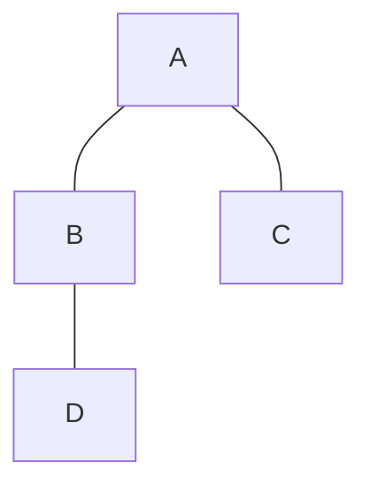
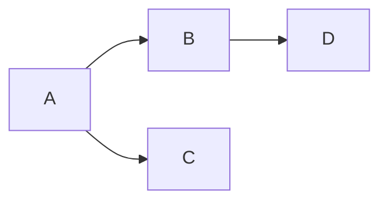
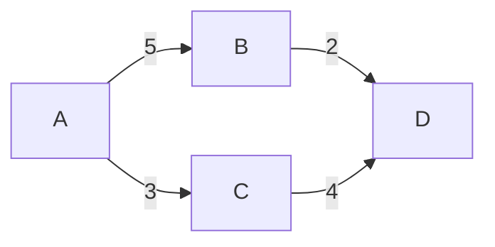

# Cours Avancé en Algorithmique — Séance 4 : Graphes et algorithmes associés  
## Partie 1 : Théorie — Représentations de Graphes (1h)  
### Contenu : Définition et terminologie des graphes (sommets, arêtes, poids, orienté/non-orienté)

---

## 1. Définition d’un graphe

Un **graphe** est une structure composée de deux ensembles :

- **Sommets (ou nœuds)** : éléments fondamentaux représentant des objets ou entités.
- **Arêtes (ou liens)** : relations ou connexions entre les sommets.

---

## 2. Terminologie de base

- Un graphe est noté \(G = (V, E)\)  
  où \(V\) est l’ensemble des sommets et \(E\) l’ensemble des arêtes.
  
- **Ordre du graphe** : nombre de sommets \( |V| = n \).

- **Taille du graphe** : nombre d’arêtes \( |E| = m \).

---

## 3. Sommets

- Un sommet est une entité identifiable dans le graphe.
- Exemples : villes dans un réseau routier, pages web sur Internet.

---

## 4. Arêtes

- Une arête relie deux sommets.
- Elle peut être caractérisée par :
  - **Entrée et sortie** (avec des sommets d’arrivée/départ),
  - **Poids** (valeur numérique associée).

---

## 5. Graphe orienté vs non-orienté

| Type de graphe         | Description                               | Implication                            |
|-----------------------|-------------------------------------------|--------------------------------------|
| **Graphe non orienté** | Arêtes sans direction, bidirectionnelles  | L’arête \(\{u,v\}\) représente une connexion entre \(u\) et \(v\) dans les deux sens. |
| **Graphe orienté**     | Arêtes avec direction (flèches)           | L’arête \((u,v)\) va de \(u\) à \(v\), sens unique. |

---

### Exemple - Graphe non orienté

---

### Exemple - Graphe orienté

---

## 6. Poids des arêtes

- Un **graphe pondéré** attribue à chaque arête un **poids** (valeur numérique) représentant par exemple :
  - Distance,
  - Coût,
  - Temps,
  - Capacité.

- Graphe pondéré peut être orienté ou non-orienté.

---

## 7. Terminologie supplémentaire

| Terme                   | Description                                 |
|-------------------------|---------------------------------------------|
| **Degré** d’un sommet   | Nombre d’arêtes incidentes (non orienté) ou sortantes/entrantes (orienté). |
| **Chemin**              | Suite de sommets reliés par des arêtes.     |
| **Cycle**               | Chemin fermé, commençant et finissant au même sommet. |
| **Composante connexe**  | Sous-graphe où tout sommet est accessible depuis tout autre. (graphe non orienté) |

---

## 8. Illustration Mermaid d’un graphe pondéré orienté

---

## 9. Sources consultées

- [Wikipedia — Graph (graph theory)](https://en.wikipedia.org/wiki/Graph_(discrete_mathematics))
- [GeeksforGeeks — Introduction to Graph and Representation](https://www.geeksforgeeks.org/graph-and-its-representations/)
- [Programiz — Graph Data Structure](https://www.programiz.com/dsa/graph-data-structure)

---

En résumé, un graphe est un modèle puissant pour représenter des relations complexes entre objets variés. La compréhension claire des sommets, arêtes, orientations et poids est fondamentale pour exploiter ces structures dans les algorithmes avancés.