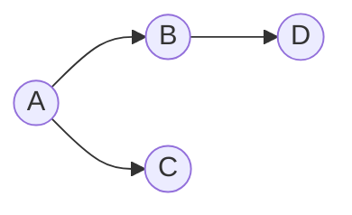

# Cours Avancé en Algorithmique — Séance 4 : Graphes et algorithmes associés  
## Partie 1 : Théorie — Représentations de Graphes (1h)  
### Contenu : Matrice d'adjacence : implémentation, avantages, inconvénients

---

## 1. Définition : Qu’est-ce qu’une Matrice d’Adjacence ?

Une **matrice d’adjacence** est une représentation d’un graphe \(G=(V,E)\) sous forme d’une matrice carrée \(n \times n\) où \(n = |V|\) est le nombre de sommets.

- Chaque ligne et chaque colonne correspond à un sommet.
- L’élément \(M[i][j]\) indique la présence (et parfois le poids) de l’arête reliant le sommet \(i\) au sommet \(j\).

---

## 2. Implémentation

### 2.1 Représentation basique

Pour un graphe non pondéré et non orienté :

\[
M[i][j] = \begin{cases}
1 & \text{si une arête existe entre } i \text{ et } j \\
0 & \text{sinon}
\end{cases}
\]

Pour un graphe orienté, \(M[i][j] = 1\) signifie une arête de \(i\) vers \(j\).

### 2.2 Matrice pondérée

On stocke le poids de l’arête :

\[
M[i][j] = \begin{cases}
w_{ij} & \text{si arête existe} \\
0 \text{ ou } \infty & \text{sinon}
\end{cases}
\]

---

## 3. Exemple d’une matrice d’adjacence pour un graphe orienté

Considérons le graphe avec sommets \(A=0, B=1, C=2, D=3\) et arêtes \(A \to B, A \to C, B \to D\).

|   | A | B | C | D |
|---|---|---|---|---|
| A | 0 | 1 | 1 | 0 |
| B | 0 | 0 | 0 | 1 |
| C | 0 | 0 | 0 | 0 |
| D | 0 | 0 | 0 | 0 |

---

## 4. Avantages de la matrice d’adjacence

- **Accès rapide** : Test instantané en \(O(1)\) de l’existence d’une arête entre deux sommets.
- **Simplicité d’implémentation** : Tableaux 2D simples.
- **Pratique pour graphes denses** où le nombre d’arêtes est proche de \(n^2\).
- **Facilite certains algorithmes** (comme l’algorithme de Floyd-Warshall pour les plus courts chemins).

---

## 5. Inconvénients

- **Espace mémoire important** : nécessite \(O(n^2)\) mémoire, inefficient pour les graphes peu denses (sparse).
- **Analyse lente** : parcourir tous les voisins d’un sommet revient à parcourir une ligne complète au lieu d’une liste.
- Peu adaptée aux graphes très grands et clairsemés.

---

## 6. Comparaison rapide avec la liste d’adjacence

| Critère               | Matrice d’adjacence        | Liste d’adjacence        |
|-----------------------|----------------------------|--------------------------|
| Complexité mémoire    | \(O(n^2)\)                 | \(O(n + m)\)             |
| Recherche d’arête     | \(O(1)\)                   | \(O(\delta)\), avec \(\delta\) degré du sommet |
| Parcours des voisins  | \(O(n)\)                   | \(O(\delta)\)            |
| Facilité d’implémentation | Simple                  | Plus complexe            |

---

## 7. Illustration Mermaid (graph orienté)

Correspondance matrice :

\[
\begin{bmatrix}
0 & 1 & 1 & 0 \\
0 & 0 & 0 & 1 \\
0 & 0 & 0 & 0 \\
0 & 0 & 0 & 0 \\
\end{bmatrix}
\]

---

## 8. Sources consultées

- [GeeksforGeeks — Adjacency Matrix](https://www.geeksforgeeks.org/graph-and-its-representations/)
- [Wikipedia — Adjacency matrix](https://en.wikipedia.org/wiki/Adjacency_matrix)
- [Programiz — Graph representation](https://www.programiz.com/dsa/graph-data-structure)
- [TutorialsPoint — Graphs Representation](https://www.tutorialspoint.com/data_structures_algorithms/graph_data_structure.htm)

---

La matrice d’adjacence est une structure simple, efficace pour les graphes petits à moyennement denses. Sa connaissance est indispensable pour la compréhension et la mise en œuvre des algorithmes sur graphes.