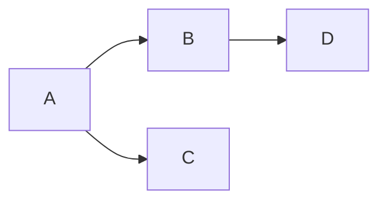

# Cours Avancé en Algorithmique — Séance 4 : Graphes et algorithmes associés  
## Partie 1 : Théorie — Représentations de Graphes (1h)  
### Contenu : Listes d'adjacence : implémentation, avantages, inconvénients

---

## 1. Définition de la liste d’adjacence

La **liste d’adjacence** est une structure de données qui représente un graphe en associant à chaque sommet une liste des sommets adjacents (voisins) auxquels il est connecté par une arête.

Formellement, pour un graphe \(G=(V,E)\), la liste d’adjacence est un tableau (ou dictionnaire) où chaque indice ou clé correspond à un sommet, et contient une liste des sommets reliés par une arête.

---

## 2. Implémentation

### Exemple pour un graphe orienté

Pour chaque sommet \(v \in V\), on stocke une liste de tous les sommets \(u\) tels que \((v, u) \in E\).

```c
// Exemple en C : déclaration simple (non pondérée)
typedef struct Node {
    int vertex;
    struct Node* next;
} Node;

Node* adjacencyList[MAX_VERTICES]; // tableau de pointeurs vers Node
```

- Chaque `adjacencyList[v]` pointe vers une liste chaînée de nœuds représentant les sommets voisins.

---

## 3. Exemple concret

Considérons le graphe orienté:

- Arêtes: \(A \to B\), \(A \to C\), \(B \to D\).

Liste d’adjacence :

| Sommet | Voisins      |
|--------|--------------|
| A      | B, C         |
| B      | D            |
| C      | (aucun)      |
| D      | (aucun)      |

---

## 4. Diagramme Mermaid illustrant ce graphe



---

## 5. Avantages des listes d’adjacence

- **Économie de mémoire** : nécessite \(O(n + m)\) où \(n\) est le nombre de sommets, \(m\) le nombre d’arêtes — bien adapté aux graphes clairsemés.
- **Parcours rapide des voisins** : on accède directement aux voisins d’un sommet sans parcourir une matrice entière.
- **Adaptabilité** : facile à étendre pour stocker des poids, propriétés, etc.

---

## 6. Inconvénients

- **Recherche d’une arête particulière** (entre deux sommets donnés) potentiellement plus coûteuse, \(O(\delta)\) avec \(\delta\) degré du sommet (parcours de la liste).
- Moins immédiat d’accès aléatoire qu’avec une matrice d’adjacence.
- Implémentation un peu plus complexe, notamment pour la gestion dynamique de mémoire.

---

## 7. Comparaison synthétique

| Critère                  | Matrice d’adjacence | Liste d’adjacence    |
|--------------------------|---------------------|---------------------|
| Utilisation mémoire      | \(O(n^2)\)          | \(O(n + m)\)        |
| Test présence arête      | \(O(1)\)            | \(O(\delta)\)       |
| Parcours voisins          | \(O(n)\)            | \(O(\delta)\)       |
| Convient pour            | Graphes denses      | Graphes clairsemés  |

---

## 8. Cas d’utilisation

- Les listes d’adjacence sont privilégiées lorsque le graphe est grand et clairsemé.
- Elles sont la base de la plupart des algorithmes sur graphes comme DFS, BFS, Dijkstra.

---

## 9. Sources consultées

- [GeeksforGeeks — Graph Representation](https://www.geeksforgeeks.org/graph-and-its-representations/)
- [Wikipedia — Adjacency List](https://en.wikipedia.org/wiki/Adjacency_list)
- [Programiz — Graph Data Structure](https://www.programiz.com/dsa/graph-data-structure)
- [TutorialsPoint — Graphs Representation](https://www.tutorialspoint.com/data_structures_algorithms/graph_data_structure.htm)

---

La liste d’adjacence, avec sa flexibilité mémoire et son efficacité pour parcourir les voisins, est la représentation incontournable pour manipuler efficacement des graphes de taille variable, notamment dans des contextes de structure clairsemée.