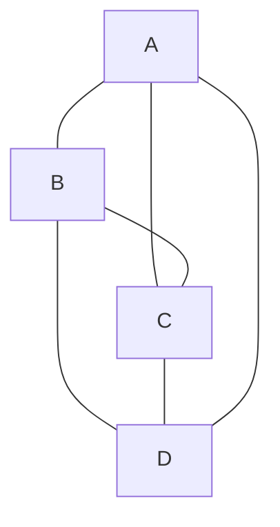
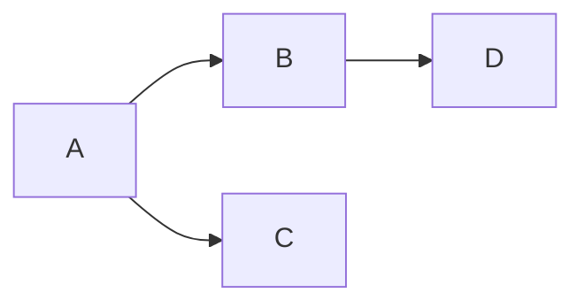

# Cours Avancé en Algorithmique — Séance 4 : Graphes et algorithmes associés  
## Partie 1 : Théorie — Représentations de Graphes (1h)  
### Contenu : Choix de représentation en fonction du problème (graphes denses/creux)

---

## 1. Introduction

Le choix de la représentation d’un graphe est essentiel pour l’efficacité des algorithmes qui lui seront appliqués. Ce choix dépend principalement de la **densité du graphe**.

---

## 2. Densité d’un graphe

La densité \(D\) est définie comme le ratio du nombre d’arêtes \(m\) par rapport au nombre maximal d’arêtes possibles.

Pour un graphe non orienté sans boucle :

\[
D = \frac{2m}{n(n-1)}
\]

avec \(n\) = nombre de sommets.

- **Graphe dense** : \(D\) proche de 1 (beaucoup d’arêtes).
- **Graphe creux (ou sparse)** : \(D\) faible, nombre d’arêtes bien inférieur à \(\frac{n(n-1)}{2}\).

---

## 3. Représentations courantes

| Représentation       | Complexité mémoire        | Accès vérification arête | Parcours voisins  | Adapté pour                   |
|---------------------|---------------------------|-------------------------|------------------|------------------------------|
| Matrice d’adjacence  | \(O(n^2)\)                | \(O(1)\)                | \(O(n)\)         | Graphes denses               |
| Listes d’adjacence   | \(O(n + m)\)              | \(O(\delta)\)           | \(O(\delta)\)    | Graphes creux (sparse)       |

\(\delta\) = degré du sommet concerné.

---

## 4. Critères pour le choix

### 4.1 Graphe dense

- Nombre d’arêtes proche de \(n^2\).
- La matrice d’adjacence, avec ses accès directs \(O(1)\), se justifie malgré son coût mémoire.
- Typiquement, graphes où presque tous les sommets sont reliés.

*Exemple* : réseaux sociaux très connectés (petit nombre de personnes).

---

### 4.2 Graphe creux (sparse)

- Nombre d’arêtes proche de \(O(n)\).
- Les listes d’adjacence économisent beaucoup de mémoire.
- Parcours directe des voisins en \(O(\delta)\).

*Exemple* : carte routière d’un pays, où chaque ville est connectée à quelques voisines seulement.

---

## 5. Exemples illustrés

### 5.1 Matrice d’adjacence d’un graphe dense

La matrice est remplie presque partout :

\[
\begin{bmatrix}
0 & 1 & 1 & 1 \\
1 & 0 & 1 & 1 \\
1 & 1 & 0 & 1 \\
1 & 1 & 1 & 0 \\
\end{bmatrix}
\]

---

### 5.2 Listes d’adjacence d’un graphe creux

Listes d’adjacence :

- A : B, C
- B : D
- C : -
- D : -

---

## 6. Impacts sur les algorithmes

- **Accès rapide aux arêtes** (matrice d’adjacence) favorise certains algorithmes (ex : Floyd-Warshall).
- **Parcours efficace des voisins** (listes) optimise DFS, BFS, Dijkstra sur graphes creux.
- Algorithme Floyd-Warshall est naturellement adapté à la matrice, Dijkstra à la liste d’adjacence.

---

## 7. Synthèse

| Caractéristique           | Matrice d’adjacence                  | Liste d’adjacence                 |
|--------------------------|------------------------------------|---------------------------------|
| Utilisation mémoire      | Exponentielle avec \(n^2\)          | Proportionnelle à \(n + m\)      |
| Recherche d’arête        | \(O(1)\)                           | \(O(\delta)\)                    |
| Parcours voisins         | \(O(n)\)                          | \(O(\delta)\)                    |
| Efficace pour            | Graphes petits et denses            | Grand graphes clairsemés         |
| Complexité programmation | Simple                            | Un peu plus complexe             |

---

## 8. Sources consultées

- [GeeksforGeeks — Graph representations](https://www.geeksforgeeks.org/graph-and-its-representations/)
- [Wikipedia — Graph density](https://en.wikipedia.org/wiki/Dense_graph)
- [Programiz — Graph Data Structure](https://www.programiz.com/dsa/graph-data-structure)
- [TutorialsPoint — Graphs Representation](https://www.tutorialspoint.com/data_structures_algorithms/graph_data_structure.htm)

---

Le choix judicieux entre matrice d'adjacence et liste d'adjacence dépend avant tout de la nature du graphe à traiter. Une bonne adéquation entre structure et problème garantit simplicité, efficacité et évolutivité des algorithmes.