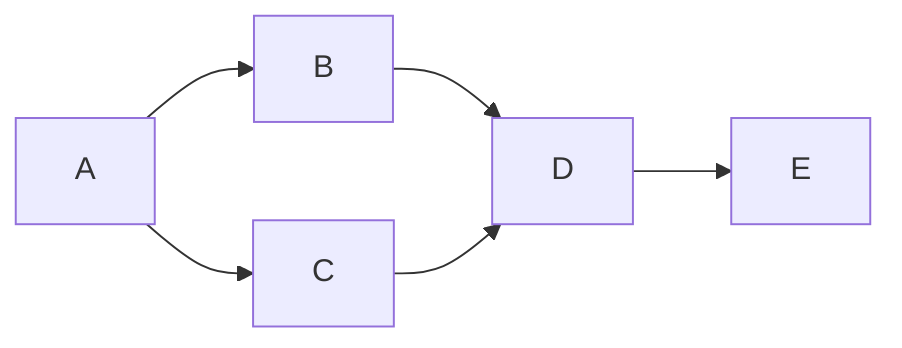

# Cours Avancé en Algorithmique — Séance 4 : Graphes et algorithmes associés  
## Partie 2 : Théorie — Algorithmes de Parcours (1h)  
### Contenu : Breadth-First Search (BFS) : principe, implémentation (file), applications

---

## 1. Principe du Breadth-First Search (BFS)

Le **parcours en largeur (BFS)** est un algorithme de parcours de graphe qui explore les sommets en couches successives selon leur distance minimum (en nombre d’arêtes) à partir d’un sommet de départ.

- Il visite d’abord tous les voisins immédiats,
- Puis les voisins des voisins,
- Et ainsi de suite.

Cela garantit la découverte de chaque sommet dans l’ordre croissant de la distance minimale au sommet source.

---

## 2. Utilisation d’une File

L’algorithme utilise une **file (queue)** pour conserver l’ordre des sommets à visiter :

- On insère le sommet source dans la file,
- Tant que la file n’est pas vide :
  - On dépile le sommet en tête,
  - On explore tous ses voisins non visités,
  - On les marque visités et on les enfile.

---

## 3. Implémentation basique (pseudo-code)

```pseudo
BFS(G, s)
  create empty queue Q
  mark s as visited
  enqueue s into Q

  while Q is not empty:
    u = dequeue Q
    for each neighbor v of u:
      if v not visited:
        mark v as visited
        enqueue v into Q
```

---

## 4. Exemple d’application

Considérons le graphe orienté suivant :



Parcours BFS à partir de A :

- File initiale : [A]
- Visite A, enfile B, C → file [B, C]
- Visite B, enfile D → file [C, D]
- Visite C, D déjà en file, pas d’ajout → file [D]
- Visite D, enfile E → file [E]
- Visite E, aucun voisin → file vide

Ordre de visite : A → B → C → D → E

---

## 5. Complexité

- Temps : \(O(n + m)\), où \(n\) est le nombre de sommets et \(m\) le nombre d’arêtes, car chaque sommet et arête sont explorés au plus une fois.
- Espace : \(O(n)\) pour le stockage des marquages et de la file.

---

## 6. Applications de BFS

- **Calcul des plus courts chemins** en graphes non pondérés (ex : nombre minimal d’arêtes).
- **Détection de composantes connexes** dans un graphe non orienté.
- **Test de bipartité** d’un graphe.
- **Parcours couche par couche** utile dans divers algorithmes de graphes (ex : réseau, intelligence artificielle).
- **Propagation dans les réseaux** (influence, diffusion).

---

## 7. Exemple de code C simplifié

```c
#include <stdio.h>
#include <stdlib.h>

#define MAX 100

typedef struct Node {
    int vertex;
    struct Node* next;
} Node;

Node* adjacencyList[MAX];
int visited[MAX];

typedef struct {
    int items[MAX];
    int front;
    int rear;
} Queue;

void enqueue(Queue* q, int val) {
    if (q->rear == MAX - 1) return;
    q->items[++q->rear] = val;
}

int dequeue(Queue* q) {
    if (q->front > q->rear) return -1;
    return q->items[q->front++];
}

int isEmpty(Queue* q) {
    return q->front > q->rear;
}

void BFS(int start, int n) {
    Queue q = { .front = 0, .rear = -1 };
    enqueue(&q, start);
    visited[start] = 1;
    while (!isEmpty(&q)) {
        int u = dequeue(&q);
        printf("%d ", u);
        Node* temp = adjacencyList[u];
        while (temp) {
            if (!visited[temp->vertex]) {
                visited[temp->vertex] = 1;
                enqueue(&q, temp->vertex);
            }
            temp = temp->next;
        }
    }
}
```

---

## 8. Sources consultées

- [GeeksforGeeks — BFS](https://www.geeksforgeeks.org/breadth-first-search-or-bfs-for-a-graph/)
- [Wikipedia — Breadth-first search](https://en.wikipedia.org/wiki/Breadth-first_search)
- [Programiz — BFS](https://www.programiz.com/dsa/graph-bfs)

---

Le BFS révèle l’organisation en couches d’un graphe à partir d’une source et est la base de nombreux algorithmes fondamentaux liés aux graphes. Son implémentation via une file garantit un ordre d’exploration contrôlé, adapté à la découverte des plus courts chemins simples dans les graphes non pondérés.