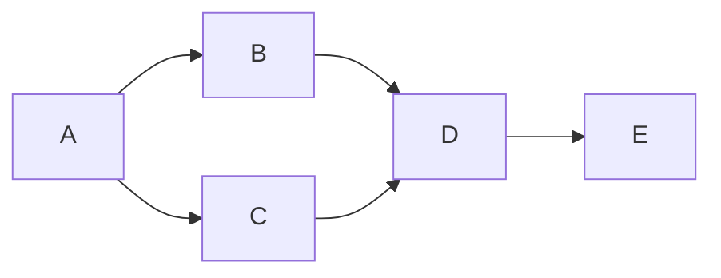

# Cours Avancé en Algorithmique — Séance 4 : Graphes et algorithmes associés  
## Partie 2 : Théorie — Algorithmes de Parcours (1h)  
### Contenu : Depth-First Search (DFS) : principe, implémentation (pile/récursivité), applications

---

## 1. Principe du Depth-First Search (DFS)

Le **parcours en profondeur (DFS)** explore un graphe en suivant un chemin jusqu’à son terme avant de revenir en arrière (backtracking) pour en explorer d’autres.

- À chaque sommet, on choisit un voisin non visité,
- On poursuit récursivement cette exploration en profondeur,
- Jusqu’à ce qu’on atteigne un sommet sans voisin non visité,
- Puis on revient sur les sommets précédents pour continuer.

Ce principe permet d’explorer pleinement toutes les branches depuis un sommet initial.

---

## 2. Implémentation

### 2.1 Version récursive

Le DFS s’implémente naturellement en récursion :

```pseudo
DFS(G, u)
  mark u as visited
  for each neighbor v of u:
    if v not visited:
      DFS(G, v)
```

---

### 2.2 Version itérative avec pile

L'implémentation équivalente non récursive utilise une **pile (stack)** :

```pseudo
DFS(G, s)
  create empty stack S
  push s onto S

  while S not empty:
    u = pop S
    if u not visited:
      mark u as visited
      for each neighbor v of u:
        push v onto S
```

---

## 3. Exemple illustré

Considérons le graphe orienté :



Un DFS initié en A peut visiter dans cet ordre (selon choix) :

- A, B, D, E, C
  - Part du sommet A,
  - Explore B (voisin de A),
  - Puis D (voisin de B),
  - Puis E (voisin de D),
  - Enfin C (voisin non visité de A).

---

## 4. Caractéristiques et Complexité

- **Temps** : \(O(n + m)\), chaque sommet et arête est exploré une fois.
- **Espace** :
  - Récursion : proportionnel à la profondeur maximale.
  - Itérative : pile contenant potentiellement autant d’éléments que la profondeur.

---

## 5. Applications

- **Détection de cycles** dans un graphe orienté et non orienté.
- **Composantes fortement connexes** (algorithme de Tarjan).
- **Topological sorting** des graphes acycliques orientés.
- Résolution de **labyrinthes et puzzles**.
- **Analyse de connectivité** et extraction de sous-graphes.

---

## 6. Exemple de code C (récursif)

```c
#include <stdio.h>
#include <stdlib.h>

#define MAX 100

typedef struct Node {
    int vertex;
    struct Node* next;
} Node;

Node* adjacencyList[MAX];
int visited[MAX];

void DFS(int u) {
    visited[u] = 1;
    printf("%d ", u);

    Node* temp = adjacencyList[u];
    while (temp != NULL) {
        if (!visited[temp->vertex]) {
            DFS(temp->vertex);
        }
        temp = temp->next;
    }
}
```

---

## 7. Sources consultées

- [GeeksforGeeks — DFS](https://www.geeksforgeeks.org/depth-first-search-or-dfs-for-a-graph/)
- [Wikipedia — Depth-first search](https://en.wikipedia.org/wiki/Depth-first_search)
- [Programiz — DFS](https://www.programiz.com/dsa/graph-dfs)

---

Le DFS est un parcours fondamental qui explore exhaustivement tous les chemins possibles d’un graphe en suivant la profondeur d’une branche. Sa mise en œuvre simple, récursive ou avec pile, permet d’aborder des problèmes complexes de structure et de connectivité dans les graphes.