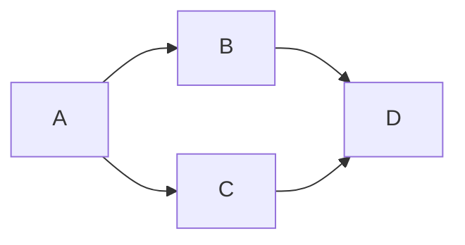

# Cours Avancé en Algorithmique — Séance 4 : Graphes et algorithmes associés  
## Partie 2 : Théorie — Algorithmes de Parcours (1h)  
### Contenu : Analyse de complexité des algorithmes de parcours (BFS, DFS)

---

## 1. Contexte

Les parcours de graphes, BFS (Breadth-First Search) et DFS (Depth-First Search), sont utilisés pour explorer les sommets et arêtes d’un graphe. Leur complexité dépend directement de la représentation du graphe (matrice d’adjacence ou liste d’adjacence) et de ses caractéristiques (nombre de sommets \(n\), nombre d’arêtes \(m\)).

---

## 2. Complexité en fonction de la représentation

### 2.1 Matrice d’adjacence

- La matrice est de taille \(n \times n\).
- Pour chaque sommet, parcourir ses voisins consiste à parcourir sa ligne complète, donc \(O(n)\).
- Le parcours total inspecte \(n\) sommets, ce qui conduit à un coût :

\[
O(n \times n) = O(n^2)
\]

- Indépendamment du nombre d’arêtes \(m\), car il faut vérifier chaque possible voisin.

### 2.2 Liste d’adjacence

- Chaque sommet stocke uniquement ses voisins.
- Parcourir les voisins d’un sommet est de complexité \(O(\delta)\) où \(\delta\) est son degré.
- La somme des degrés sur tous les sommets vaut \(2m\) (pour un graphe non orienté) ou \(m\) (orienté).
- La complexité totale est donc :

\[
O(n + m)
\]

- Car on visite chaque sommet une fois, et chaque arête au plus une fois.

---

## 3. Applications sur BFS et DFS

| Algorithme | Complexité avec matrice | Complexité avec liste d’adjacence |
|------------|------------------------|----------------------------------|
| BFS        | \(O(n^2)\)             | \(O(n + m)\)                     |
| DFS        | \(O(n^2)\)             | \(O(n + m)\)                     |

- Ces complexités optimales tirent parti d’une représentation adaptée.
- Pour graphes clairsemés (\(m \ll n^2\)), la liste d’adjacence est largement plus efficace.

---

## 4. Illustration Mermaid — Graphe orienté simple

Pour ce graphe, \(n=4\), \(m=4\).

- Liste d’adjacence parcourt la somme des listes voisins (4 arêtes),
- Matrice d’adjacence parcourt \(n^2 = 16\) éléments.

---

## 5. Exemple chiffré

Prenons un graphe avec 1000 sommets :

- Densité faible : 5000 arêtes.
- Matrice d’adjacence : \(O(1000^2) = 1,000,000\) opérations.
- Liste d’adjacence : \(O(1000 + 5000) = 6000\) opérations.

Gain très net en temps et en mémoire.

---

## 6. Conclusion

L’efficacité des parcours BFS et DFS dépend intrinsèquement de la représentation des graphes.

- Matrice d’adjacence acceptable pour petits graphes ou graphes très denses.
- Liste d’adjacence préférable pour graphes de grande taille et clairsemés, commun en pratique.

---

## 7. Sources consultées

- [GeeksforGeeks — BFS and DFS Complexity](https://www.geeksforgeeks.org/breadth-first-search-or-bfs-for-a-graph/)
- [Wikipedia — Graph traversal](https://en.wikipedia.org/wiki/Graph_traversal)
- [Programiz — Graph BFS and DFS](https://www.programiz.com/dsa/graph-bfs)
- [TutorialsPoint — BFS and DFS](https://www.tutorialspoint.com/data_structures_algorithms/graph_data_structure.htm)

---

Cette analyse guide le choix d’implémentation pour garantir la meilleure efficacité algorithmique lors de l’exploration d’un graphe.