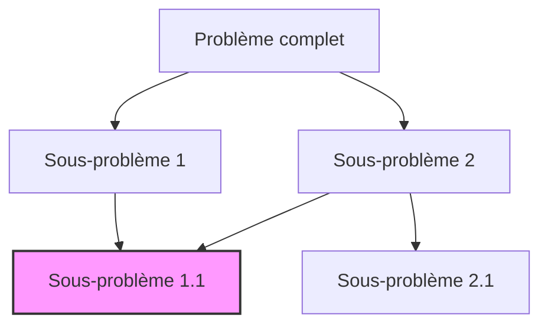

# Cours Avancé en Algorithmique — Séance 6 : Programmation Dynamique 
## Partie 1 : Théorie — Introduction à la Programmation Dynamique  
### Contenu : Quand utiliser la programmation dynamique (sous-problèmes chevauchants, sous-structure optimale)

---

## 1. Qu’est-ce que la Programmation Dynamique (PD) ?

La programmation dynamique est une méthode algorithmique qui permet de résoudre efficacement des problèmes de décision, optimisation ou de comptage en **évitant les calculs redondants** via la mémorisation des résultats de sous-problèmes déjà résolus.

---

## 2. Indications pour utiliser la programmation dynamique

Deux propriétés fondamentales doivent être vérifiées par le problème :

### 2.1 Sous-problèmes chevauchants (Overlapping subproblems)

- Le problème peut être décomposé en sous-problèmes de plus petite taille,
- Ces sous-problèmes se répètent plusieurs fois dans la résolution globale.

Sans programmation dynamique, on risquerait de recalculer les mêmes résultats plusieurs fois (exponentiel typiquement).

**Exemple simple** : Calcul du \(n\)-ième terme de la suite de Fibonacci.

- La définition récursive est : \(F(n) = F(n-1) + F(n-2)\),
- Les sous-problèmes \(F(n-1)\) et \(F(n-2)\) se recoupent avec plusieurs appels récursifs,
- Mémoriser \(F(k)\) pour tout \(k\) évite la répétition.

---

### 2.2 Sous-structure optimale (Optimal substructure)

- La solution optimale globale peut se construire à partir de solutions optimales de ses sous-problèmes.
- Toutes les solutions partielles optimales concourent à la solution finale optimale.

**Exemple** : Problème du plus long sous-ensemble croissant (LIS).

- La séquence optimale jusqu’à un indice \(i\) dépend des solutions optimales jusqu’à \(j < i\).
- Résoudre chaque sous-problème avec sa solution optimale incite à la programmation dynamique.

---

## 3. Diagramme Mermaid — Relation entre les sous-problèmes



Le sous-problème \(D\) est partagé par plusieurs branches de décomposition.

---

## 4. Exemple : Fibonacci naïf vs programmation dynamique

### Fibonacci naïf (récursif simple)

```c
int fib(int n) {
    if (n <= 1)
        return n;
    return fib(n-1) + fib(n-2);
}
```

- Complexité exponentielle \(O(2^n)\),
- Beaucoup de recalculs.

### Fibonacci avec programmation dynamique (mémorisation)

```c
int fib(int n, int memo[]) {
    if (memo[n] != -1)
        return memo[n];
    if (n <= 1)
        memo[n] = n;
    else
        memo[n] = fib(n-1, memo) + fib(n-2, memo);
    return memo[n];
}
```

- Complexité \(O(n)\),
- Résultats intermédiaires calculés une seule fois.

---

## 5. Résumé

| Propriété                    | Description                                   | Détection pratique             |
|-----------------------------|-----------------------------------------------|-------------------------------|
| Sous-problèmes chevauchants | Les mêmes sous-problèmes apparaissent souvent | Vérifier le graphe de récursion |
| Sous-structure optimale      | Solution globale construite à partir d’optimales partielles | Chercher une relation récursive optimale |

---

## 6. Sources consultées

- [Wikipedia — Programming Dynamic](https://en.wikipedia.org/wiki/Dynamic_programming)
- [GeeksforGeeks — Introduction to Dynamic Programming](https://www.geeksforgeeks.org/dynamic-programming/)
- [Programiz — Dynamic Programming](https://www.programiz.com/dsa/dynamic-programming)
- [Big O Cheat Sheet — Dynamic Programming](https://www.bigocheatsheet.com/)

---

La programmation dynamique transforme des problèmes combinatoires potentiellement exponentiels en solutions plus maniables, sous réserve que les facteurs de sous-problèmes chevauchants et de sous-structure optimale soient présents. La mémorisation systématique des résultats intermédiaires est la clé de sa puissance.