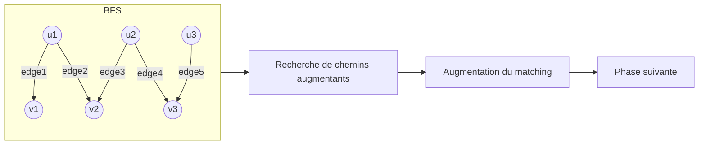

# Algorithmes de matching bipartite et autres optimisations  
## Matching bipartite : définition, propriétés et algorithme Hopcroft-Karp

---

## 1. Introduction au matching bipartite

Un **graphe bipartite** est un graphe dont l'ensemble des sommets peut être partitionné en deux ensembles disjoints \(U\) et \(V\) tels que toutes les arêtes connectent un sommet de \(U\) à un sommet de \(V\).

Un **matching** dans un graphe est un ensemble d’arêtes telles qu’aucune paire d’arêtes ne partage un sommet commun. Un **matching maximum** est un matching de plus grande taille possible dans ce graphe.

---

## 2. Propriétés fondamentales

- Dans un graphe bipartite, il existe des algorithmes spécifiques plus efficaces que dans le cas général pour trouver un matching maximum.  
- Théorème de König : dans un graphe bipartite, la taille du plus grand matching est égale à la taille du plus petit recouvrement de sommets (vertex cover minimum).  
- Applications : affectation de tâches, appariement homme-femme, allocation de ressources.

---

## 3. Algorithme Hopcroft-Karp

L’algorithme **Hopcroft-Karp** (1973) est un algorithme efficace pour trouver un **matching maximum** dans un graphe bipartite en temps \(O(\sqrt{V} E)\), où \(V\) est le nombre de sommets et \(E\) le nombre d’arêtes.

### 3.1 Principe général

- Fonctionne en itérations (phases).  
- Chaque phase recherche un ensemble maximal de chemins augmentants disjoints les plus courts possibles.  
- Un **chemin augmentant** est un chemin qui alterne entre arêtes non incluses et incluses dans le matching, débutant et finissant sur un sommet non apparié. Inverser l’état des arêtes sur ce chemin augmente la taille du matching de 1.

### 3.2 Étapes clefs

1. **BFS (Breadth First Search)** : pour construire un niveau des sommets à partir des sommets libres en \(U\), identifier les chemins augmentants de longueur minimale.  
2. **DFS (Depth First Search)** : pour chercher et extraire un maximum de chemins augmentants disjoints à cette profondeur.  
3. Inversion des arêtes sur ces chemins, extension du matching.  
4. Répéter jusqu'à ce qu’il n’existe plus de chemin augmentant.

### 3.3 Complexité

- Amélioration sur l’algorithme d’augmentation naïf :  
\(O(\sqrt{|V|} \cdot |E|)\) contre \(O(|V| \cdot |E|)\).

---

## 4. Exemple illustratif

Considérons un graphe bipartite :

- \(U = \{u_1, u_2, u_3\}\)  
- \(V = \{v_1, v_2, v_3\}\)  
- Arêtes : \((u_1,v_1), (u_1,v_2), (u_2,v_2), (u_2,v_3), (u_3,v_3)\).

L'algorithme identifie d’abord des chemins augmentants courts, par exemple :

- \(u_1 \rightarrow v_1\) (arête libre)  
- \(u_2 \rightarrow v_2\) (arête libre)  
ensuite, en phase suivante, détecte des chemins alternants permettant d’augmenter le matching.

---

## 5. Diagramme Mermaid illustrant une phase Hopcroft-Karp

---

## 6. Applications concrètes

| Domaine                    | Exemple d’utilisation                                  |
|---------------------------|-------------------------------------------------------|
| Attribution de tâches      | Assigner employés à postes disponibles                 |
| Recommandation systèmes    | Apparier utilisateurs avec produits ou partenaires    |
| Réseaux de communication  | Allocations de canaux, routage optimisé                |

---

## 7. Sources et références

- Hopcroft, John E., and Richard M. Karp. “An \(n^{5/2}\) algorithm for maximum matchings in bipartite graphs.” SIAM Journal on Computing 2.4 (1973): 225-231.  
- Cormen, Thomas H., et al. *Introduction to Algorithms*. 3rd ed., MIT Press, 2009. Chapitre 26.  
- Wikipedia, "Hopcroft–Karp algorithm": https://en.wikipedia.org/wiki/Hopcroft%E2%80%93Karp_algorithm  
- Lecture notes Stanford CS161: https://web.stanford.edu/class/cs161/lectures/lecture07.pdf  

---

Cet article expose la définition rigoureuse du matching bipartite, des propriétés fondamentales, et détaille l’algorithme Hopcroft-Karp. Sa complexité améliorée en fait un outil privilégié pour résoudre efficacement des problèmes d’appariement dans de nombreux domaines.