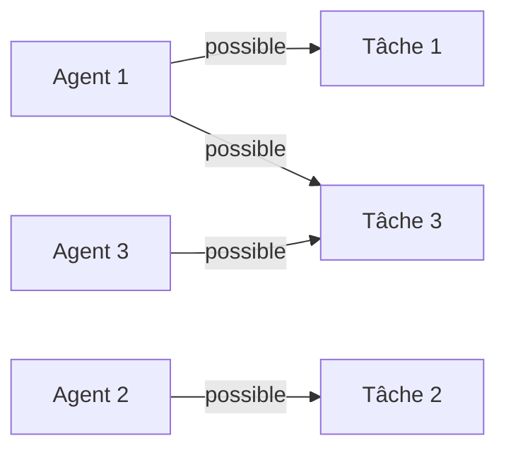
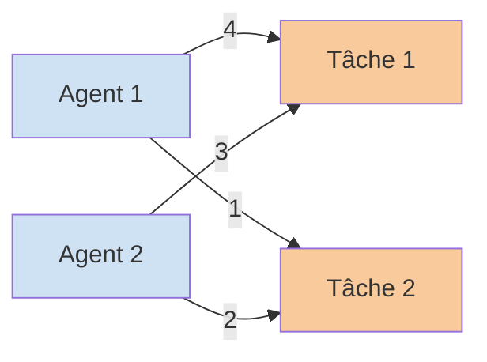

# Algorithmes de matching bipartite et autres optimisations  
## Applications pratiques du matching bipartite

---

## 1. Introduction

Le **matching bipartite** est un concept clé en théorie des graphes qui trouve de nombreuses applications pratiques dans divers domaines où il s'agit d'associer efficacement des éléments de deux ensembles distincts. Cette modélisation permet de résoudre des problèmes concrets d'affectation, d'appariement et d'optimisation dans des contextes industriels, sociaux ou informatiques.

---

## 2. Applications principales

### 2.1 Attribution de ressources et planification

#### Exemple : affectation de tâches à des agents

- Problème classique où un ensemble d'agents doit être affecté à un ensemble de tâches, chaque agent ne pouvant réaliser qu’une tâche.  
- Le problème se modélise par un graphe bipartite avec agents dans \(U\) et tâches dans \(V\).  
- Le matching maximum donne la meilleure distribution possible de tâches.

#### Exemple Mermaid pour illustration

---

### 2.2 Recommandation et appariement en systèmes sociaux

- Applications dans les plateformes de rencontres ou sites de coworking, où il faut apparier efficacement deux catégories d’utilisateurs selon leurs préférences et contraintes.  
- Exemple : apparition d'un système de matching bipartite permettant de maximiser les correspondances compatibles.

---

### 2.3 Réseaux et télécommunications

- Allocation optimale des canaux de communication dans un réseau où les canaux sont limités et doivent être assignés à des utilisateurs ou nœuds pour éviter les interférences.  
- Le matching bipartite aide à modéliser les contraintes d’attribution dans des réseaux 5G, Wi-Fi, ou réseaux radio.

---

### 2.4 Logistique et transport

- Appariement entre véhicules (chauffeurs) et marchandises/livraisons.  
- Optimisation dynamique des tournées en fonction de disponibilité, lieu, contraintes horaires.

---

## 3. Cas avancé : matching bipartite pondéré

- Au-delà de la simple maximisation du nombre d’appariements, **le matching bipartite pondéré** intègre un coût ou profit associé à chaque arête.  
- Résolution par exemple à l’aide de l’algorithme de Kuhn-Munkres (ou algorithme hongrois).  
- Permet d’optimiser la somme des poids des arêtes dans le matching.

---

## 4. Représentation Mermaid d’un matching pondéré minimal

---

## 5. Exemples concrets d’utilisation

| Domaine                 | Problème concret                                | Algorithme recommandé                  |
|------------------------|------------------------------------------------|---------------------------------------|
| Ressources humaines    | Affecter des employés à des postes               | Hopcroft-Karp pour matching maximum   |
| Plateformes de rencontre | Apparier profils avec contraintes                | Matching bipartite pondéré             |
| Réseaux sans fil       | Allocation de fréquences sans interférence       | Matching maximum, parfois pondéré     |
| Logistique             | Attribution véhicules-livraisons                  | Matching pondéré avec contraintes     |

---

## 6. Conclusion

Le matching bipartite dépasse la simple théorie pour devenir un outil indispensable dans des applications variées traitant de problématiques d’allocation optimale et d’appariement sous contraintes. Sa modélisation simple et les algorithmes efficaces qu’il bénéficie en font un levier puissant d’optimisation.

---

## 7. Sources et références

- Kuhn, Harold W. "The Hungarian method for the assignment problem." Naval Research Logistics Quarterly 2.1-2 (1955): 83-97.  
- Hopcroft, John E., and Richard M. Karp. “An \(n^{5/2}\) algorithm for maximum matchings in bipartite graphs.” SIAM Journal on Computing 2.4 (1973): 225-231.  
- Wikipedia :  
  - Bipartite Matching: https://en.wikipedia.org/wiki/Bipartite_matching  
  - Hungarian Algorithm: https://en.wikipedia.org/wiki/Hungarian_algorithm  
- Applications récentes :  
  - T. Erlebach, M. Mihalák, & M. Widmayer, "Matching problems in social networks," *J. Graph Algorithms Appl.*, 2014.  
  - R. Singh et al., "Resource allocation in 5G networks," IEEE Communications Surveys, 2021.

---

Cet article fournit une vue claire des domaines où la recherche de matching bipartite s’applique concrètement, illustrée par des exemples et modèles visuels, accompagné de références pour approfondir la compréhension et l’utilisation pratique.